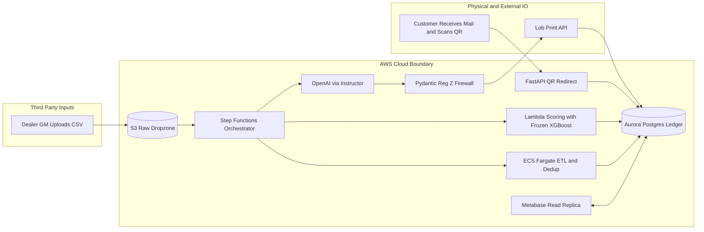
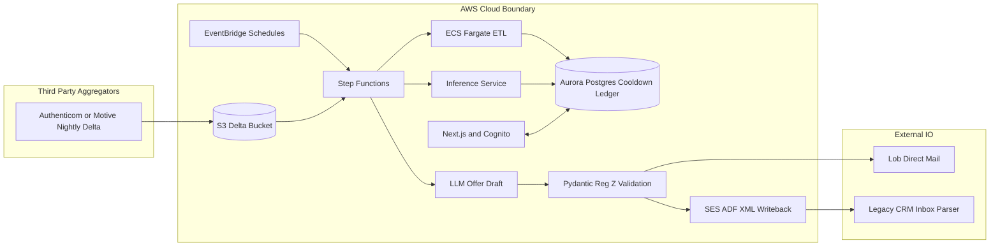
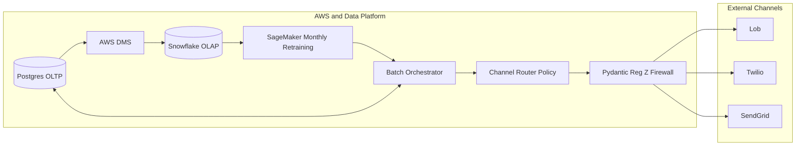
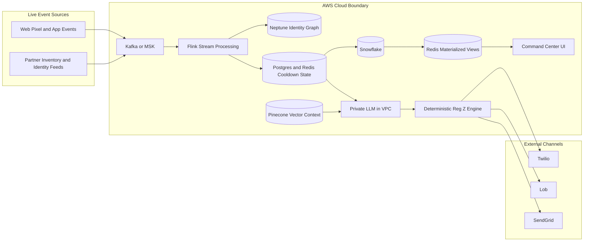
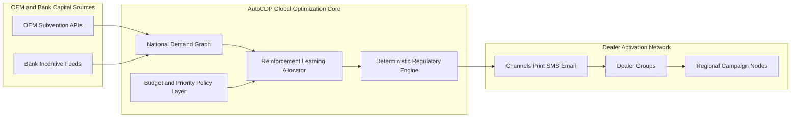

# AutoCDP System Architecture Output (V1→V5)

This document is the engineering artifact set for architecture visualization and implementation planning.

---

## 1) Version Pipeline Snapshot

| Version | Dealer Scale | Revenue Target | Core Mode |
|---|---:|---:|---|
| V1 Breadboard | 1–5 | $0–$1M ARR | Manual-assisted async batch |
| V2 Microcontroller | 5–50 | $1M–$9M ARR | Fully automated scheduled batch |
| V3 Superscalar | 50–500 | $9M–$90M ARR | Batch + MLOps + omnichannel routing |
| V4 SoC Streaming | 500–5,000+ | $100M–$500M+ ARR | Real-time event-driven activation |
| V5 Global Neural Network | 5,000–20,000+ | $500M+ ARR | Market-making subsidy optimizer |

---

## 2) Mermaid Architecture Diagrams (GitHub-safe syntax)

### 2.1 V1 Breadboard (1–5 Dealers, $0–$1M ARR)



### 2.2 V2 Microcontroller (5–50 Dealers, $1M–$9M ARR)



### 2.3 V3 Superscalar (50–500 Dealers, $9M–$90M ARR)



### 2.4 V4 SoC Streaming (500–5,000+ Dealers, $100M–$500M+ ARR)



### 2.5 V5 Global Neural Network (5,000–20,000+ Dealers, $500M+ ARR)



---

## 3) End-to-End User Journey by Version

### V1 End-to-End
- **Scale and Revenue:** 1–5 dealers; **$0–$1M ARR**.
- Dealer GM uploads historical CRM CSV to S3.
- Nightly batch cleans and dedupes data into Golden Records.
- XGBoost scores likely buyers.
- LLM drafts offer, then Reg Z validator recalculates and approves.
- Lob prints and mails; customer scans QR; system records attribution.

### V2 End-to-End
- **Scale and Revenue:** 5–50 dealers; **$1M–$9M ARR**.
- Aggregator drops daily deltas automatically.
- EventBridge runs nightly sync and print cadence.
- Cooldown ledger blocks ineligible records before actuation.
- SES sends ADF XML notes to CRM inbox for write-back visibility.
- GM monitors spend/results in self-serve dashboard.

### V3 End-to-End
- **Scale and Revenue:** 50–500 dealers; **$9M–$90M ARR**.
- Monthly retraining adjusts propensity model weights.
- Router selects cheapest compliant channel (mail/SMS/email).
- Guardrail validation still gates all outbound content.
- Snowflake powers enterprise analytics and attribution at scale.

### V4 End-to-End
- **Scale and Revenue:** 500–5,000+ dealers; **$100M–$500M+ ARR**.
- Web events stream in real time via Kafka/MSK.
- Flink + Neptune resolve identity and context on-the-fly.
- Private LLM generates offer text with vector-grounded inventory context.
- Deterministic legal engine approves; channel is dispatched instantly.
- Command center updates in near-real-time via Redis materialized views.

### V5 End-to-End
- **Scale and Revenue:** 5,000–20,000+ dealers; **$500M+ ARR**.
- OEM and bank subsidies stream into optimization layer.
- RL allocator distributes incentives by geography, propensity, inventory, and constraints.
- Regulatory engine enforces compliant pricing/terms before market actuation.
- AutoCDP behaves as a national activation clearinghouse across dealer networks.

---

## 4) Relational Schema (PostgreSQL OLTP)

```sql
CREATE TABLE dealerships (
  id BIGSERIAL PRIMARY KEY,
  dealer_code TEXT UNIQUE NOT NULL,
  name TEXT NOT NULL,
  timezone TEXT NOT NULL,
  created_at TIMESTAMPTZ NOT NULL DEFAULT now()
);

CREATE TABLE customers (
  id BIGSERIAL PRIMARY KEY,
  dealership_id BIGINT NOT NULL REFERENCES dealerships(id),
  external_customer_key TEXT,
  first_name TEXT,
  last_name TEXT,
  email TEXT,
  phone_e164 TEXT,
  address_line1 TEXT,
  city TEXT,
  state TEXT,
  postal_code TEXT,
  dedupe_hash TEXT NOT NULL,
  created_at TIMESTAMPTZ NOT NULL DEFAULT now(),
  updated_at TIMESTAMPTZ NOT NULL DEFAULT now(),
  UNIQUE (dealership_id, dedupe_hash)
);

CREATE TABLE propensity_scores (
  id BIGSERIAL PRIMARY KEY,
  customer_id BIGINT NOT NULL REFERENCES customers(id),
  model_version TEXT NOT NULL,
  score NUMERIC(5,4) NOT NULL CHECK (score >= 0 AND score <= 1),
  feature_snapshot JSONB NOT NULL,
  scored_at TIMESTAMPTZ NOT NULL DEFAULT now()
);

CREATE TABLE cooldown_ledger (
  id BIGSERIAL PRIMARY KEY,
  customer_id BIGINT NOT NULL REFERENCES customers(id),
  channel TEXT NOT NULL CHECK (channel IN ('DIRECT_MAIL','SMS','EMAIL')),
  locked_until TIMESTAMPTZ NOT NULL,
  reason TEXT NOT NULL,
  created_at TIMESTAMPTZ NOT NULL DEFAULT now(),
  UNIQUE (customer_id, channel)
);

CREATE TABLE campaign_offers (
  id BIGSERIAL PRIMARY KEY,
  customer_id BIGINT NOT NULL REFERENCES customers(id),
  channel TEXT NOT NULL CHECK (channel IN ('DIRECT_MAIL','SMS','EMAIL')),
  offer_json JSONB NOT NULL,
  regz_validated BOOLEAN NOT NULL DEFAULT FALSE,
  regz_validation_details JSONB,
  status TEXT NOT NULL CHECK (status IN ('QUEUED','APPROVED','SENT','FAILED','BLOCKED_COOLDOWN')),
  created_at TIMESTAMPTZ NOT NULL DEFAULT now(),
  sent_at TIMESTAMPTZ
);
```

---

## 5) Terraform Starter (V1 and V2 Batch-First)

```hcl
terraform {
  required_version = ">= 1.6.0"
  required_providers {
    aws = {
      source  = "hashicorp/aws"
      version = "~> 5.0"
    }
  }
}

provider "aws" {
  region = var.aws_region
}

variable "aws_region" { type = string }
variable "project" { type = string }

resource "aws_s3_bucket" "raw_dropzone" {
  bucket = "${var.project}-raw-dropzone"
}

resource "aws_cloudwatch_event_rule" "nightly_sync" {
  name                = "${var.project}-nightly-sync"
  schedule_expression = "cron(0 2 * * ? *)"
}

resource "aws_ecs_cluster" "etl" {
  name = "${var.project}-etl"
}

resource "aws_ses_email_identity" "adf_sender" {
  email = "adf-writeback@${var.project}.example.com"
}
```

---

## 6) Non-Negotiable Guardrails
1. V1–V3 remain asynchronous batch systems; no high-QPS synchronous ingestion architecture.
2. No direct CRM read API dependency in V1–V3; use nightly aggregator drops.
3. No direct CRM write API dependency in V1–V3; use SES with ADF XML payloads.
4. Deterministic Reg Z validation must gate all outbound offers.
5. Cooldown ledger checks must occur before any channel dispatch.

