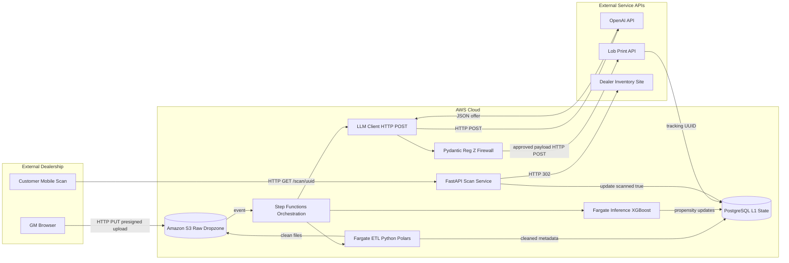
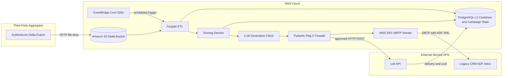
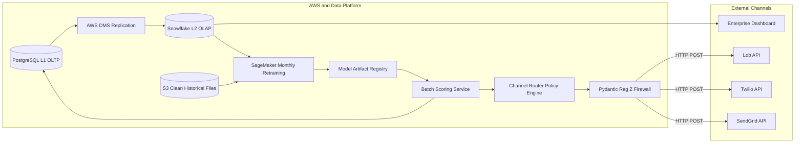
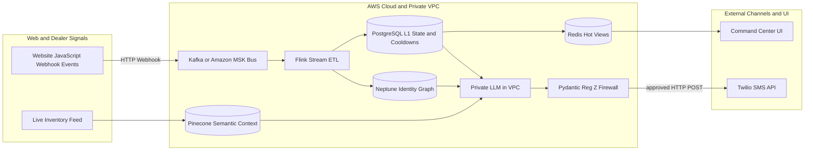

# AutoCDP Whitepaper
## The Autonomous Activation Layer for Automotive Retail (V1–V4)

> **Executive Summary**  
> AutoCDP is engineered as a **regulation-aware activation operating system** for automotive retail: ingesting fragmented dealership data, converting entropy into deterministic customer state, and autonomously executing compliant, measurable, multi-channel campaigns. The roadmap deliberately starts as an **asynchronous batch platform** (V1–V3) where throughput and legal correctness dominate, then transitions into a **real-time event-driven system-on-chip architecture** (V4) to unlock enterprise-scale personalization and speed.

---

## 1) Strategic Thesis: Why AutoCDP Exists

The automotive retail stack is structurally inefficient:
- Legacy CRM systems hold critical data behind expensive integration tolls.
- Marketing spend is high, but attribution and compliance are weak.
- AI potential is real, but legal exposure (APR/payment hallucinations) is existential.

AutoCDP addresses this by combining:
1. **Cost-avoidant data access** through batch drops (SFTP/S3), not fee-heavy two-way CRM APIs.
2. **Deterministic state control** in PostgreSQL (cooldowns, campaign state, attribution).
3. **ML-driven prioritization** to route spend only toward high-propensity customers.
4. **Generative content under hard legal guardrails** (Pydantic validation before dispatch).
5. **Closed-loop tracking** across physical and digital channels.

### Financial and Scale Trajectory

| Version | Timeline | Target Dealerships | Target ARR | Strategic Inflection |
|---|---|---:|---:|---|
| **V1** | Months 1–3 | 1–5 | $0–$1M | Proof of model accuracy + print ROI with legal-safe AI |
| **V2** | Months 4–12 | 5–50 | $1M–$9M | Full automation + CRM write-back without API tolls |
| **V3** | Year 2 | 50–500 | $9M–$90M | Margin defense via omnichannel routing + MLOps flywheel |
| **V4** | Year 3+ | 500–5,000 | $100M+ | Real-time identity-driven activation at enterprise scale |

---

## 2) Architectural Principle: Cloud Memory Hierarchy

AutoCDP mirrors hardware memory design to preserve performance and reliability:

- **LLC / Persistent Storage — Amazon S3**  
  Raw CRM files and historical training corpora live in low-cost, high-durability object storage.
- **L1 / Transactional State — PostgreSQL**  
  Canonical customer state, scores, cooldown windows, campaign and attribution records.
- **L2 / Analytics Plane — Snowflake (V3+)**  
  High-volume analytical queries and multi-year reporting, isolated from OLTP pressure.

This separation prevents a common anti-pattern: mixing heavy analytical scans with customer-facing transaction logic.

---

## 3) Versioned Roadmap

## Version 1 — Asynchronous Batch Processor (MVP)

### V1 Metrics

| Field | Value |
|---|---|
| **Timeline** | Months 1–3 |
| **Target Dealerships** | 1–5 pilot rooftops |
| **Target ARR** | $0–$1M |

### Business Vision
V1 proves the system’s three founding claims:
1. **Data can be normalized deterministically** from noisy dealership exports.
2. **ML can prioritize likely buyers** better than manual campaign selection.
3. **AI copy can remain legally safe** through deterministic financial validation before print.

The objective is not raw scale; it is **mathematical proof of ROI and compliance**.

### System Architecture (Technical Plumbing)
V1 is intentionally a throughput-oriented async flow:
- Dealer uploads files directly to S3 using secure pre-signed URL + **HTTP PUT** (avoids web server memory saturation).
- S3 event triggers compute orchestration; Fargate ETL reads raw file, standardizes records, writes cleaned state back into S3 and Postgres.
- Inference container loads static XGBoost weights and updates propensity scores in Postgres.
- Offer generation calls LLM via **HTTP POST**, but output is blocked until Pydantic verifies legal math.
- Approved offers dispatch to Lob via **HTTP POST**; tracking UUID persisted in Postgres.
- Customer QR scan calls FastAPI via **HTTP GET**; service updates attribution and emits **HTTP 302 redirect**.

### V1 Dataflow Diagram

### End-to-End Walkthrough
A GM uploads a 3-year CRM export at 8:00 PM. By 2:15 AM, ETL and scoring complete, identifying a lease customer at 0.89 propensity. The LLM drafts a lease offer; Pydantic recomputes terms and rejects one illegal monthly payment attempt, then approves corrected output. Lob prints, customer scans the QR next day, and attribution closes in Postgres.

---

## Version 2 — Automated Nightly Sync (SaaS Engine)

### V2 Metrics

| Field | Value |
|---|---|
| **Timeline** | Months 4–12 |
| **Target Dealerships** | 5–50 |
| **Target ARR** | $1M–$9M |

### Business Vision
V2 converts a concierge workflow into a repeatable SaaS engine:
- No manual uploads.
- No recurring CRM API certification fees.
- Campaign and CRM visibility synchronized nightly with minimal human intervention.

### System Architecture (Technical Plumbing)
Key delta from V1:
- EventBridge schedule acts as system clock (2:00 AM nightly jobs).
- Third-party middleware (e.g., Authenticom) extracts CRM deltas and transfers via **SFTP** into S3.
- Pipeline checks cooldown ledger in Postgres before any actuation.
- On successful print, SES sends ADF XML note via **SMTP** to CRM routing address; CRM parses XML and writes activity note.

This preserves LLC/L1 separation and adds **write-back visibility without direct CRM APIs**.

### V2 Dataflow Diagram

### End-to-End Walkthrough
At 2:00 AM, EventBridge triggers the pipeline. Authenticom’s delta file includes a recent service visit for a previously low-propensity customer. Score rises to 0.91. Cooldown check passes (last mail was 58 days ago), print dispatches via Lob, and SES posts an ADF note into the CRM timeline by sunrise.

---

## Version 3 — Multi-Channel + Continuous Learning

### V3 Metrics

| Field | Value |
|---|---|
| **Timeline** | Year 2 |
| **Target Dealerships** | 50–500 |
| **Target ARR** | $9M–$90M |

### Business Vision
V3 is about **margin intelligence**:
- Shift volume from expensive print to lower-cost digital channels when allowed.
- Improve model quality monthly from real conversion outcomes.
- Maintain legal and operational determinism as channel complexity rises.

### System Architecture (Technical Plumbing)
Core expansion:
- OLTP (Postgres) replicates to OLAP (Snowflake) to separate transactional integrity from heavy analytics.
- Router evaluates cooldown state and channel eligibility, then dispatches via Twilio/SendGrid/Lob.
- SageMaker retraining uses clean history + outcome labels, updates model artifacts, redeploys scoring weights.

Result: lower CAC pressure while preserving throughput and auditability.

### V3 Dataflow Diagram

### End-to-End Walkthrough
A customer is score-qualified at 0.87. Router sees direct mail cooldown active but SMS open. Offer is generated and legally validated, then dispatched via Twilio for $0.01 versus $1.00 print cost. Later, the conversion appears in Snowflake; monthly retraining adjusts feature importance, increasing future routing precision.

---

## Version 4 — Real-Time Event-Driven Platform (System-on-a-Chip)

### V4 Metrics

| Field | Value |
|---|---|
| **Timeline** | Year 3+ |
| **Target Dealerships** | 500–5,000 |
| **Target ARR** | $100M+ |

### Business Vision
V4 transforms AutoCDP from batch operator into **real-time activation infrastructure**:
- Event ingestion at web-session speed.
- Identity resolution from anonymous signals to known CRM entities.
- Inventory-aware, context-specific offers while user intent is live.

### System Architecture (Technical Plumbing)
Major shifts:
- Kafka/MSK replaces nightly file cadence as primary event bus.
- Neptune graph maps behavioral identifiers to customer entities.
- Pinecone provides retrieval context for inventory-to-customer matching.
- Private VPC-hosted LLM handles PII-sensitive generation; deterministic guardrail remains hard gate.
- Twilio dispatches in-session communications within seconds.

Even at real-time speed, compliance remains deterministic and auditable.

### V4 Dataflow Diagram

### End-to-End Walkthrough
At 10:00:03 AM, a shopper views a high-margin truck online. Webhook enters Kafka instantly. Stream ETL resolves identity through graph links to a known service customer with positive equity. Pinecone retrieves relevant in-stock vehicles, private LLM drafts a personalized offer, Pydantic validates terms, and Twilio message lands while the user is still on-site.

---

## 4) Enterprise Control Plane and Risk Posture

### Non-Negotiable Guardrails
- **No direct CRM read APIs (V1–V3):** Use neutral batch aggregation to avoid integration rent.
- **No direct CRM write APIs (V1–V3):** Use SES + ADF XML to avoid toll fees.
- **No outbound message without deterministic validation:** Reg Z math must be recomputed and schema-approved.
- **Cooldown enforcement precedes every channel action.**

### Operating Risks and Mitigations

| Risk | Potential Impact | Mitigation |
|---|---|---|
| LLM hallucinated finance terms | Regulatory liability | Hard Pydantic recalculation and reject-on-fail |
| CRM integration lock-in costs | Margin erosion | SFTP ingestion + SMTP ADF write-back pattern |
| OLTP saturation from analytics | UI latency and failed jobs | Snowflake OLAP split + replication |
| Channel overspend/spam | Budget waste and opt-outs | Central cooldown ledger + router policies |
| Streaming complexity in V4 | Operational fragility | Progressive rollout, SLOs, and staged failover |

---

## 5) Board-Level Conclusion

> AutoCDP is not merely a campaign tool; it is a **deterministic activation infrastructure** designed to convert fragmented automotive data into compliant revenue actions. The roadmap intentionally compounds capability: proving legal-safe ROI in batch mode first, then scaling to real-time enterprise execution once unit economics, data quality, and controls are battle-tested.

