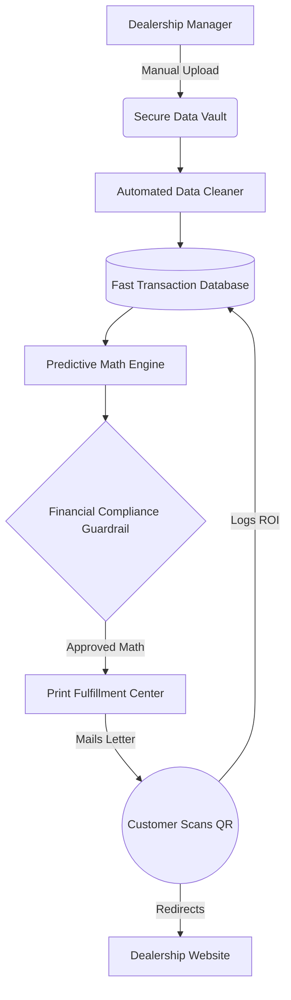
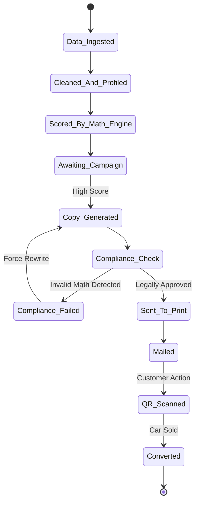
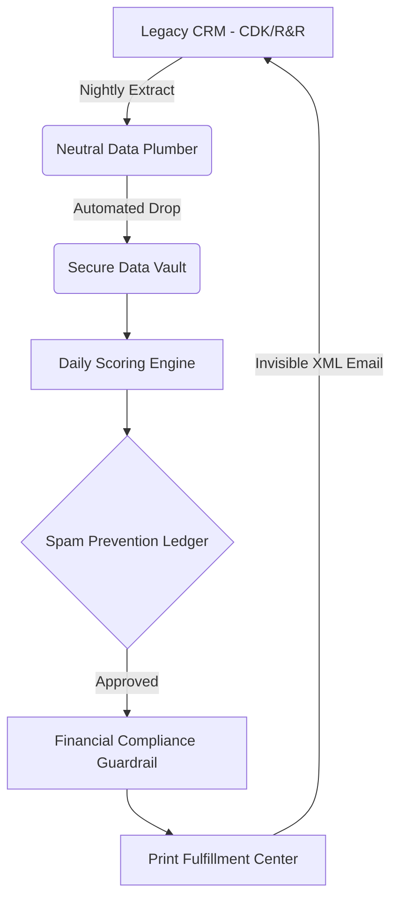
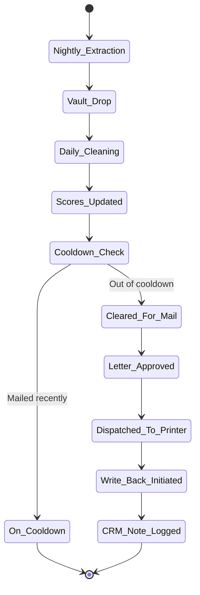
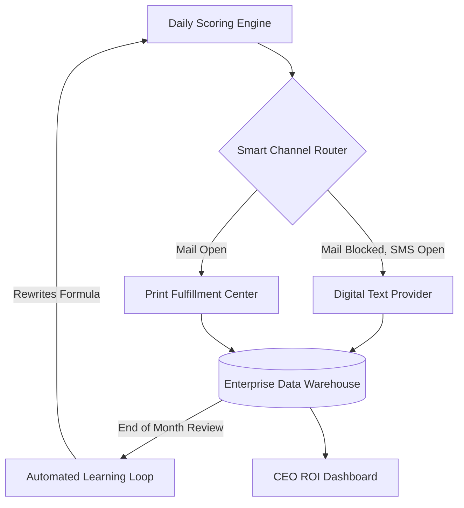
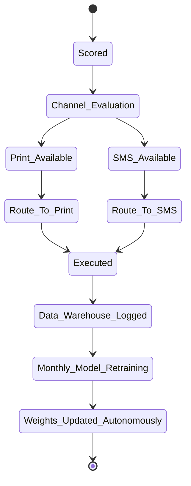
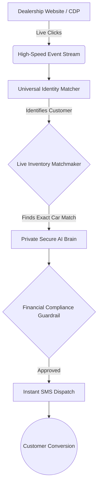
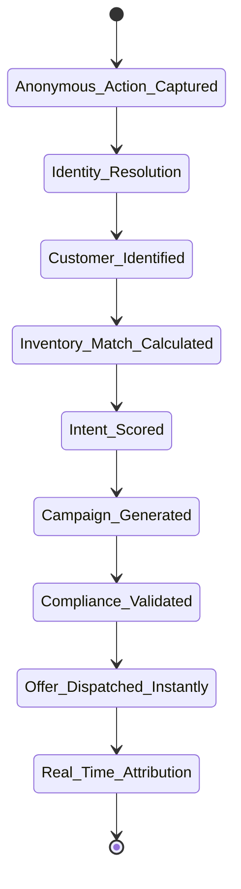

# AutoCDP: The Autonomous Activation Layer for Automotive Retail
**Master Business Vision & Strategic Architecture Roadmap (V1 - V4)**

## 1. Executive Summary & Financial Thesis
The automotive retail industry ($1.5 Trillion market) operates on highly fragmented, antiquated legacy CRM mainframes. Because dealership data is trapped, General Managers routinely spend $10,000 to $20,000 per month on untrackable physical direct mail and generic digital spam with zero mathematical proof of Return on Investment (ROI).

AutoCDP is a decoupled, highly secure **Autonomous Activation Engine**. We securely ingest messy dealership data, utilize automated data-cleaning engines, run Predictive Math Models to identify guaranteed buyers, and use Generative AI—restricted by strict financial compliance firewalls—to autonomously execute and track multi-channel marketing.

**The Financial Math:**
* **Target Scale:** 100 Dealerships (capturing just 0.55% of the US Franchised Market).
* **Revenue Rate:** 100 rooftops × $15,000/mo = $1.5M/mo or **$18M Annual Recurring Revenue (ARR)**.
* **Profitability:** ~50% Gross Margins (**$9M Profit**).
* **Valuation Target:** Enterprise Tech Multiples (6x to 8x ARR) = **$108,000,000+**.

---

## 2. Industry Landscape & Strategic Moat
To achieve a $100M+ valuation, we must navigate the specific monopolistic roadblocks of the automotive software industry. Our architecture is designed not just for scale, but for strategic evasion and market dominance.

### The Legacy Cartels (CDK Global & Reynolds and Reynolds)
The core operating systems that run modern dealerships are controlled by legacy mainframes (primarily CDK and Reynolds & Reynolds). These companies operate as technology cartels; they hold dealership data hostage and charge extortionate "integration and certification fees" (often $50,000+ upfront and thousands per month) to allow third-party vendors to read or write data.
* **Our Strategy:** We completely bypass these toll fees. We read data through neutral 3rd-party aggregators, and we "write" data back to the CRM using an invisible backdoor: a 1999 industry-standard XML email format. This allows dealership sales teams to see our system's notes inside their CRM without us paying a single dollar to the monopolies.

### The CDP Shift & The FullPath Threat
The auto industry is currently trying to escape data silos by purchasing Customer Data Platforms (CDPs) like FullPath. Dealerships are exhausted by fragmented data and are paying CDPs to unify their customer records.
* **The Platform Risk:** FullPath is aggressively trying to centralize all dealership data, but they are also pivoting into marketing, making them a direct competitor. If we use FullPath's API to extract our raw data, we expose our client list to a competitor and risk platform de-activation.
* **Our Extraction Strategy:** For data ingestion, we partner exclusively with neutral, pure-play aggregators (like Authenticom or Motive Retail). They are simple "Data Plumbers" who charge a tiny flat fee to securely extract data. They do not do marketing, meaning they have zero incentive to steal our business.

### Our Trojan Horse Strategy (The Activation Layer)
We do not compete with CDPs like FullPath for data storage; we sit *on top* of them.
Silicon Valley CDPs are effectively just expensive digital filing cabinets. They are decent at sending generic emails, but they refuse to handle the messy reality of physical direct mail or the severe legal liability of drafting hard-coded financial lease offers (Truth-in-Lending compliance).
**The Pitch:** When a dealership says, "We already use FullPath," our response is: *"Great. FullPath is your filing cabinet. AutoCDP is your robotic arm. We extract the highest-intent buyers from your CDP, run the strict FinTech compliance math, and autonomously execute the complex physical and digital campaigns that generate actual car sales."*

---

## 3. Data Storage Philosophy (The System Foundation)
To ensure enterprise-grade security and keep cloud computing costs near zero when the system is idle, our software separates how data is stored, processed, and analyzed into three distinct layers:

1. **The Secure Data Vault (Cold Storage):** A highly secure, infinitely scalable digital vault. It holds massive, raw spreadsheets from the dealerships. We never delete raw data; it acts as our permanent historical ledger to rewind and replay data if a dealership makes an error.
2. **The Fast Transaction Database (Live State):** A high-speed, lightweight database. It holds only the clean, essential metadata (Customer IDs, Propensity Scores, and Spam-Blocker Timers). Our daily marketing engine uses this to make split-second routing decisions without getting bogged down by heavy files.
3. **The Enterprise Data Warehouse (Analytics):** Introduced in Version 3. A massive reporting database designed specifically for Dealer Group CEOs. It instantly aggregates millions of historical records to generate multi-year ROI dashboards across 50 dealerships in milliseconds without crashing the active marketing system.

---

## 4. The Architecture & Product Roadmap (Versions 1 - 4)

### VERSION 1: The "Proof of Concept" Factory (MVP)
* **Timeline:** Months 1 - 3
* **Scale:** 1 to 5 Pilot Dealerships
* **Revenue Target:** $0 to $1M ARR
* **Business Goal:** Mathematically prove AI predictions and physical print ROI with $0 spent on legacy API integration fees.

**End-to-End Data Flow:**
The Dealership Manager drops a massive historical spreadsheet into our Secure Data Vault. An automated "Digital Janitor" wakes up, scrubs the messy data, removes duplicates, and logs the clean profiles into the Fast Transaction Database. A frozen Predictive Math Engine assigns a "likelihood to buy" score to every customer. High-scoring customers are passed to the AI to draft a customized letter. Before printing, a strict Financial Compliance Guardrail mathematically recalculates the lease numbers to guarantee federal Truth-in-Lending (Reg Z) compliance. A unique QR code is mailed. When the customer scans it, the system logs the ROI and redirects them to the dealership website.

#### V1 Architectural Diagram

#### V1 Customer State Machine

---

### VERSION 2: The Automated SaaS Engine
* **Timeline:** Months 4 - 12
* **Scale:** 5 to 50 Dealerships
* **Revenue Target:** $1M to $9M ARR
* **Business Goal:** Remove human file uploads, automate the daily scoring loop, and invisibly write notes back to the Dealership CRM to establish a high-margin recurring revenue model.

**End-to-End Data Flow (Delta from V1):**
An automated clock wakes the system up every night. A neutral Data Plumber securely extracts daily CRM changes and drops them into our Vault. Before printing a letter, the system checks a Spam Prevention Ledger to ensure we never mail the same person twice in 45 days. When a letter is printed, our system automatically generates an invisible XML email to the dealership CRM's backdoor address, which natively drops a sticky note on the salesman's screen: "AutoCDP mailed a Lease Offer today."

#### V2 Architectural Diagram

#### V2 Daily Sync State Machine

---

### VERSION 3: Multi-Channel & Continuous Learning
* **Timeline:** Year 2
* **Scale:** 50 to 500 Dealerships
* **Revenue Target:** $9M to $90M ARR
* **Business Goal:** Protect profit margins dynamically by routing communications to cheaper digital channels, and automate the improvement of the math model without human engineers.

**End-to-End Data Flow (Delta from V2):**
Data is continuously copied to a massive Enterprise Data Warehouse so CEOs can load real-time analytics without crashing the active marketing system. A Smart Channel Router checks the Spam Ledger. If a customer is blocked from physical mail ($1.00 cost) but open to a text message ($0.01 cost), the system routes the AI copy to a Digital Text Provider. Once a month, an Automated Learning Loop looks at actual sales data, calculates its own prediction errors, tweaks its mathematical weights to become smarter, and permanently upgrades the core scoring engine.

#### V3 Architectural Diagram

#### V3 Routing & Learning State Machine

---

### VERSION 4: The Real-Time Activation Platform
* **Timeline:** Year 3+
* **Scale:** 500 to 5,000 Dealerships
* **Revenue Target:** $100M+ ARR
* **Business Goal:** Transition from overnight batch processing to a massively parallel streaming architecture. We become the real-time execution layer sitting atop Enterprise CDPs, matching digital intent to physical inventory instantly.

**End-to-End Data Flow (Delta from V3):**
We replace overnight batch drops with a High-Speed Event Stream. A Universal Identity Matcher intercepts an anonymous website click and cross-references network history to prove the "anonymous iPhone" is actually a specific customer in the CRM. A Live Inventory Matchmaker converts the lot's inventory into mathematical arrays, comparing the customer's trade-in equity against the lot to dynamically structure a custom lease. Because we process live financial data, we run a highly secure Private AI Brain inside our own digital walls. It writes the text, clears the compliance firewall, and sends the offer to the customer's phone before they even close their browser.

#### V4 Architectural Diagram

#### V4 Real-Time Streaming State Machine

