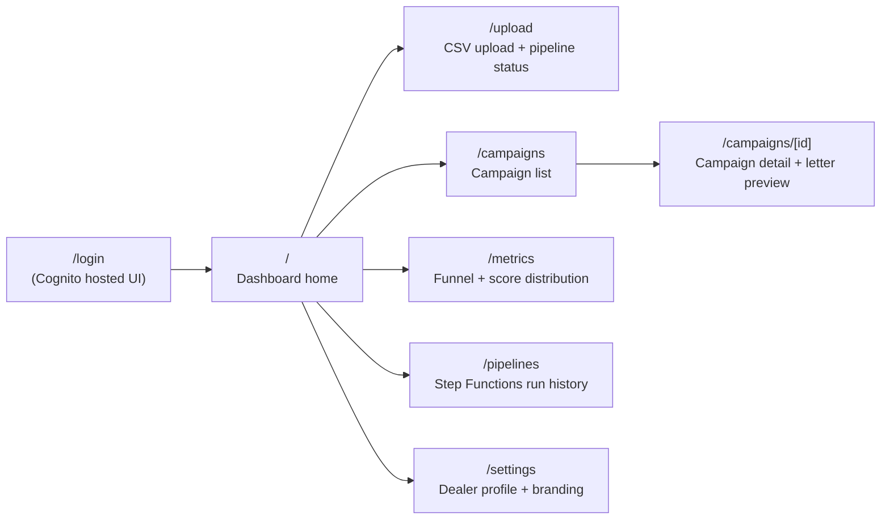

# AutoCDP V1 Pilot — Pre-Data Execution Plan (Detailed)
**Prepared for: First Meeting with Bryant (Thursday)**
**Scope: V1 MVP (1-5 Pilot Dealerships), Months 1-3**

---

## 0. What This Revision Adds

The first draft of this plan treated synthetic data as a panacea and ignored the frontend. Both were wrong.

This revision:

- **Adds the frontend as a first-class workstream.** The V1 architecture document leaned on Metabase for analytics, but for a credible pilot we need a real dealer-facing dashboard. Frontend work is the largest single block of pre-data work we can do.
- **Tightens the synthetic-data policy.** Generating fake raw CRM exports without ever having seen a real one is a setup for rework. We use synthetic data only where we own the schema on both sides; for everything CRM-shaped, we hold until we get a 10-row anonymized sample (which is the cheapest, fastest ask of the pilot dealer).
- **Finalizes the tech stack** so engineering can start Monday without bikeshedding.
- **Sketches the UI** so we know what we're building.
- **Sequences the work** week-by-week with explicit blockers, deliverables, and what each component needs from Track B to become real.

---

## 1. The Three Buckets (Revised Framing)

Every V1 task falls into exactly one of three buckets. The pre-data plan is built around moving as much work as possible into Bucket 1 and Bucket 2, and minimizing time spent stuck in Bucket 3.

| Bucket | Description | Synthetic Data? | Bryant Dependency |
|---|---|---|---|
| **1. Self-contained** | We own both ends. Examples: frontend UI, database schema, compliance math, LLM prompt against our internal `golden_records` shape, infrastructure provisioning. | Fine — we control the format on both sides. | None. Start Monday. |
| **2. Sample-unlocked** | We need to *see* real CRM structure before building. Examples: ETL column mapping, data-cleaning heuristics, realistic synthetic-data generator, feature-engineering validation. | Premature without a sample. | Cheapest ask: a 10-row **anonymized** sample. Not the full DPA-gated export — just enough to see column names, date formats, encoding, null patterns. |
| **3. Full-data-dependent** | Requires the actual historical export. Examples: training a model that predicts real conversions, validating predictions against real outcomes, sending real letters to real customers. | No. Real data only. | Signed DPA + SOW + full export from pilot dealer. |

The plan: spend weeks 1-3 emptying Bucket 1, push Bryant for a sample to unlock Bucket 2 by week 2, and clear Bucket 3 in weeks 4-5 once the full export lands.

---

## 2. Tech Stack — Finalized

These choices are presented as decisions, not options, so we can stop debating and start shipping. Each is justified relative to V2/V3 forward compatibility (per the architecture docs already in this repo).

### 2.1 Frontend

| Layer | Choice | Why |
|---|---|---|
| Framework | **Next.js 14 (App Router) + TypeScript** | Already the V2 plan. Strict typing across API boundary. Server Components reduce client bundle size. Built-in API routes useful for proxying. |
| Styling | **Tailwind CSS** | Fast iteration, no CSS file management, well-documented patterns. |
| Component library | **shadcn/ui** (Radix primitives + Tailwind) | Copy-in components, not a dependency. Accessibility built in. Enterprise-grade visuals out of the box. |
| Charts | **Recharts** for standard charts, **Tremor** for dashboard KPI cards | Recharts is the React standard. Tremor's pre-built dashboard primitives save a week. |
| Server state | **TanStack Query** | Cache, refetch, optimistic updates. Pairs cleanly with our REST API. |
| Client state | **Zustand** | Tiny, no boilerplate. Use only for cross-page UI state. |
| Forms | **React Hook Form + Zod** | Zod schemas double as TS types and runtime validators. |
| Auth | **AWS Cognito Hosted UI** | V2 already plans Cognito; building it now avoids a rewrite. Use Cognito-hosted login for V1 to skip building auth UI. |
| Hosting | **Vercel** for Next.js (V1 → V2 → V3) | Zero-config deploys. Preview environments per PR. Vercel Pro ~$50/mo. |
| Error tracking | **Sentry** | Frontend + backend tracing in one tool. Generous free tier. |
| Testing | **Vitest** (unit), **Playwright** (E2E) | Vitest is faster than Jest for Vite/Next projects. Playwright covers Chrome, Firefox, Safari. |

### 2.2 Backend

| Layer | Choice | Why |
|---|---|---|
| Language | **Python 3.12** | Polars, instructor, psycopg3, XGBoost all native. Same language as ETL + ML keeps the team unified. |
| Lambda runtime | **AWS Lambda (Python)** for Scoring, Selection, Generation, Dispatch | Per V1 architecture. Cold start acceptable for non-real-time work. |
| QR redirect service | **FastAPI on ECS Fargate** | Always-on, low-latency. FastAPI's async support handles burst scan traffic. |
| ETL service | **ECS Fargate task running Polars** | Per V1 spec. Avoids the 15-min Lambda timeout. |
| API gateway | **AWS API Gateway HTTP API** | Cognito JWT authorizer built in. |
| LLM client | **instructor + Pydantic** | Structured outputs validated against schemas. The V1 spec already commits to this pattern. |
| LLM provider | **Anthropic Claude (claude-sonnet-4-6)** via Bedrock first, direct API as fallback | Best-in-class instruction following for compliance-sensitive copy. Bedrock keeps PII inside AWS. |
| Schema validation | **Pydantic v2** | Shared schemas between frontend (via OpenAPI codegen) and backend. |
| DB driver | **psycopg3 (async)** | Native async for Lambda + Fargate. Connection pooling via PgBouncer (V2). |

### 2.3 Data + ML

| Layer | Choice | Why |
|---|---|---|
| OLTP database | **Aurora PostgreSQL Serverless v2** | Per V1 architecture. Schema-per-dealer, scales to V3. |
| Object storage | **S3** (`autocdp-raw-vault`, `autocdp-processed`) | Per V1 spec. |
| Model framework | **XGBoost** | Best for tabular data, interpretable, fast to train. |
| Feature pipeline | **Polars** in the ETL Fargate task | Same library, no Pandas drift. |
| Analytics (V1 interim) | **Metabase on Fargate**, dropped in favor of native dashboard for V1.5 | Metabase only used internally for ad-hoc queries. Dealer-facing analytics goes in the Next.js dashboard. |
| Print fulfillment | **Lob.com** | Per V1 spec. |

### 2.4 Infrastructure + Tooling

| Layer | Choice | Why |
|---|---|---|
| IaC | **AWS CDK (Python)** | One language across infra + apps. Better abstractions than Terraform for AWS-only stacks. |
| CI/CD | **GitHub Actions** | Native AWS OIDC integration, no long-lived credentials. |
| Secrets | **AWS Secrets Manager** | Per V1 spec. |
| Monitoring | **CloudWatch + X-Ray (backend), Sentry (frontend)** | Native AWS tracing, Sentry for client-side issues. |
| Code quality | **ruff + mypy + pre-commit** (Python), **eslint + prettier + tsc** (TS) | Standard, no novel choices. |
| Repo structure | **Monorepo** with `apps/web`, `apps/api`, `apps/etl`, `infra/`, `packages/shared` | Single PR can change schema + API + frontend together. |

---

## 3. UI/UX Scope and Wireframes

### 3.1 V1 Frontend Page Inventory



Eight routes total for V1. All but `/login` are protected.

### 3.2 Information Architecture per Page

**`/` Dashboard home** — *"How is my marketing performing this month?"*
- Top: 4 KPI cards (Active Campaigns, Letters Dispatched This Month, QR Scans, Conversions)
- Middle: 30-day stacked area chart (dispatched / scanned / converted)
- Bottom-left: Recent 5 campaigns table (linkable)
- Bottom-right: Last pipeline run summary (records ingested, offers generated, compliance pass rate)

```
+----------------------------------------------------------+
|  AutoCDP    [Dealer XYZ ▾]                  [User ▾]    |
+----------------------------------------------------------+
| [ 1,247  ] [ 312  ] [ 89  ] [ 14  ]                     |
| Active     Letters  QR     Sales                         |
| campaigns  sent     scans  converted                     |
+----------------------------------------------------------+
|  30-day performance                                     |
|  ▁▂▃▄▅▆▇█▇▆▅▄▃▂▁  (stacked area)                       |
+----------------------------------------------------------+
| Recent campaigns          |  Last pipeline run           |
| Mike J.  04/19  scanned   |  Apr 19, 2:14 AM             |
| Sara K.  04/18  delivered |  - 8,412 records ingested    |
| Tom B.   04/18  dispatched|  - 312 offers generated      |
| ...                       |  - 99.7% compliance pass     |
+----------------------------------------------------------+
```

**`/upload` CSV upload** — *"How do I get my customer list in?"*
- Drag-and-drop zone or file picker
- File validation (size, type) before pre-signed URL request
- Progress bar during upload
- Once uploaded: live pipeline status panel polling `/api/v1/pipeline/{execution_id}/status` every 5s
- Stages shown: Ingesting → Cleaning → Scoring → Selecting → Generating → Dispatched
- On completion: summary card with counts + link to `/pipelines/{execution_id}`

```
+----------------------------------------------------------+
|  Upload customer file                                    |
+----------------------------------------------------------+
|                                                          |
|         +------------------------------------+           |
|         |   Drop CSV here or click to browse  |          |
|         +------------------------------------+           |
|                                                          |
|  Max 200 MB. CSV format. UTF-8 encoded.                  |
+----------------------------------------------------------+
|  Pipeline run #abc123                                    |
|  [✓] Ingesting       8,412 rows                          |
|  [✓] Cleaning        8,401 valid (11 rejected)           |
|  [→] Scoring         in progress...                      |
|  [ ] Selecting                                           |
|  [ ] Generating                                          |
|  [ ] Dispatching                                         |
+----------------------------------------------------------+
```

**`/campaigns` Campaigns list** — *"Who got mailed and what happened?"*
- Paginated table: Customer (initials only by default, click to reveal), Date Sent, Status badge, Channel, Offer Payment, QR Scanned, Converted
- Filter chips: Status, Date Range, Channel (mail for V1; SMS/email greyed)
- Search by customer name or campaign UUID
- Row click → `/campaigns/[id]`

**`/campaigns/[id]` Campaign detail** — *"What exactly did we send?"*
- Header: customer name (full), date sent, status, channel
- Left column: rendered preview of the actual mailer (PDF embed) — pulled from Lob's render endpoint
- Right column: structured offer details (APR, monthly payment, term, vehicle ID), compliance result (PASSED/FAILED with math validation log), QR scan timeline, conversion status
- Bottom: complete audit log (every state transition with timestamp)

**`/metrics` Metrics** — *"How effective is this overall?"*
- Conversion funnel widget: Records Scored → Selected → Generated → Compliance Passed → Dispatched → Delivered → Scanned → Converted
- Score distribution histogram (how many customers fall in each propensity bucket)
- Compliance failure breakdown (which math checks failed most often — useful for prompt tuning)
- 90-day rolling conversion rate trend

**`/pipelines` Pipeline run history** — *"Did last night work?"*
- Table of recent Step Functions executions: started, duration, status, records processed, link to run detail
- Filter by status (succeeded / failed / running)

**`/pipelines/[id]` Pipeline run detail** — *"What happened in this run?"*
- Stage-by-stage timing chart
- Records processed at each stage with drop-off counts
- Errors and warnings (linked to specific records)

**`/settings` Settings** — *"How do I configure my account?"*
- Dealer profile (name, address, primary contact, dealership inventory URL used for QR redirects)
- Branding (logo upload, signature image, color accent)
- Letterhead preferences (which fields appear, regulatory disclosure language)
- API keys (V1 admins only — V2 will move to Cognito-only)
- Compliance contact (whose email gets notified on compliance failures)

### 3.3 Design System Decisions

- **Layout:** Persistent left sidebar (8 routes), top bar with dealer switcher (V2 multi-dealer) and user menu, main content area.
- **Density:** Medium-density tables (32px row height). Dealers will scan a lot of rows.
- **Color palette:** Neutral grays + one accent (blue or green, dealer can override in settings via branding).
- **No dark mode in V1.** Dealers work in well-lit offices. Saves a week.
- **Loading patterns:** Skeleton screens for table loads, spinners only for transient actions (clicking a button).
- **Empty states:** Every list page gets a designed empty state with "Upload your first file" CTA.
- **Toast notifications** for async ops (Lob print submitted, pipeline kicked off, file uploaded).
- **Confirmation modals** for destructive actions (deleting a pipeline run, invalidating an API key).

---

## 4. Synthetic Data Policy (Explicit)

The first draft of this plan said "test everything with synthetic data." That was sloppy. Here is the explicit policy:

| Use case | Synthetic OK? | Reasoning |
|---|---|---|
| Populating the frontend during UI development | **Yes** | The frontend talks to our API, which talks to our `golden_records` schema. We own both ends. Fake `golden_records` rows look like real ones because we define the format. |
| Exercising the API endpoints (campaigns, metrics, pipeline status) | **Yes** | Same reason. We're testing software, not data integration. |
| Validating the Compliance Guardrail's math | **Yes** | Pure math. APR validation, payment validation, residual math. No data dependency at all. |
| Iterating on LLM prompts | **Yes, conditionally** | The LLM input is our internal *post-ETL* customer profile, which we define. We can generate plausible profile shapes (equity, lease months remaining, credit tier) without knowing CRM column names. The risk is that synthetic profiles miss edge cases that real customers have — we accept that risk now and refine with real data later. |
| Print template QA (sending test letters to ourselves) | **Yes** | Lob doesn't care if the name on the letter is real. |
| QR redirect service load testing | **Yes** | Generate fake tracking UUIDs in our DB, scan them, watch the service handle the redirects. |
| **Building the ETL column-mapping pipeline** | **NO — defer** | The whole point of ETL is to translate from CDK/R&R/DealerSocket column conventions to our `golden_records` schema. Without knowing what the source columns *actually look like*, we'd be guessing. Even with a 10-row anonymized sample, we'd know an order of magnitude more than we know today. **This work waits for the sample.** |
| **Generating realistic-looking dealer CSVs for end-to-end pipeline tests** | **NO — defer** | Same reason. Once we have a 10-row sample, our synthetic generator can mimic the real patterns. Before then, we're inventing. |
| **Training the propensity model** | **NO — never on synthetic** | The model's job is to predict real human behavior. Training on synthetic data produces a model that predicts synthetic patterns. Worse than useless: it would give us false confidence. |
| **Validating model predictions** | **NO — never on synthetic** | Same. |

**The 10-row anonymized sample is the cheapest, fastest, highest-leverage ask we can make of the pilot dealer.** It does not require a signed DPA (no PII), it can be produced in 5 minutes from any CRM, and it unlocks roughly 2 weeks of otherwise-blocked work.

---

## 5. Track A — Self-Contained Work (Weeks 1-4, No Data Required)

This is the bulk of the build. Each subsection lists concrete deliverables, owners (placeholder), and dependencies.

### 5.1 Repository, Tech Stack, and Tooling (Days 1-3)

- [ ] Monorepo skeleton created (`apps/web`, `apps/api`, `apps/etl`, `infra/`, `packages/shared`)
- [ ] Pre-commit hooks: ruff, mypy, eslint, prettier, tsc
- [ ] GitHub Actions: lint + typecheck + unit tests on PR, deploy on merge to main
- [ ] Vercel project linked for frontend preview deploys
- [ ] AWS CDK project bootstrapped (`cdk bootstrap` in target account)
- [ ] Sentry projects created (frontend, backend)
- [ ] Anthropic API key + Lob sandbox key in Secrets Manager
- [ ] Local dev: docker-compose for Postgres + LocalStack S3

### 5.2 Database Schema (Days 2-4)

- [ ] V1 DDL (`v1/database_schema.sql`) deployed to Aurora dev environment
- [ ] `provision_dealer_schema()` function tested by creating `dealer_test` schema end-to-end
- [ ] Migration tooling chosen and configured (Alembic or sqitch)
- [ ] Seed script: insert one row into `dealers` table for the test dealer
- [ ] Read replica configured for future Metabase/internal use

### 5.3 AWS Infrastructure (Days 3-7)

Via CDK stacks:
- [ ] `NetworkStack`: VPC, subnets, security groups, NAT gateway
- [ ] `DataStack`: Aurora Serverless v2 cluster, S3 buckets (raw-vault, processed, frontend-assets), KMS keys
- [ ] `ComputeStack`: ECS Fargate cluster, Lambda functions (stubs), ECR repositories
- [ ] `OrchestrationStack`: Step Functions state machine wiring stub Lambdas
- [ ] `IngestionStack`: S3 → EventBridge → Step Functions trigger
- [ ] `AuthStack`: Cognito user pool, hosted UI domain, app client
- [ ] `ApiStack`: API Gateway HTTP API with Cognito JWT authorizer
- [ ] CloudWatch dashboards: per-service error rate, Lambda duration P50/P99, Aurora ACU usage

### 5.4 Frontend Workstream (Weeks 1-4) — Largest Single Block of Track A

This is roughly 3 person-weeks of solid frontend work and runs through the entire pre-data window.

**Week 1:**
- [ ] Design system in Figma (or code-first via shadcn): typography, spacing, color, button/input/card primitives
- [ ] App shell: sidebar nav, top bar, route layout
- [ ] Cognito auth flow: login redirect, callback, token refresh, logout
- [ ] Protected route HOC; redirect unauthenticated users to `/login`

**Week 2:**
- [ ] Dashboard home page wired to mock API (TanStack Query with MSW for mocking)
- [ ] KPI cards (Tremor primitives)
- [ ] 30-day performance chart (Recharts)
- [ ] Campaigns list page with pagination, filtering, sorting

**Week 3:**
- [ ] Campaign detail page with letter preview (PDF embed via Lob render endpoint)
- [ ] Upload page with drag-and-drop, pre-signed URL flow, progress, live pipeline status
- [ ] Metrics page with conversion funnel + score histogram (Recharts)

**Week 4:**
- [ ] Pipelines list + detail
- [ ] Settings: dealer profile, branding upload, API key management
- [ ] Toast + modal system, empty states, loading skeletons
- [ ] Playwright E2E tests covering happy path of every page

**Important:** the frontend talks to a real backend API throughout this period — but the data behind the API is synthetic `golden_records` rows we seed into the dev DB. We test the *contract*, not data integration.

### 5.5 Backend Workstream (Weeks 1-4)

**Week 1:**
- [ ] `POST /api/v1/upload/presigned-url` (S3 pre-signed URL generation)
- [ ] `GET /api/v1/scan/{tracking_uuid}` (FastAPI QR redirect service on Fargate)
- [ ] Cognito JWT validation middleware for protected endpoints
- [ ] Health check + structured logging baseline

**Week 2:**
- [ ] `GET /api/v1/campaigns/{dealer_id}` (paginated, filterable)
- [ ] `GET /api/v1/campaigns/{dealer_id}/{campaign_id}` (detail with compliance + scans)
- [ ] `GET /api/v1/metrics/{dealer_id}/summary` (aggregated metrics, returns from `golden_records` + `campaign_ledger`)
- [ ] `POST /api/v1/pipeline/trigger` (manual pipeline trigger)
- [ ] `GET /api/v1/pipeline/{execution_id}/status` (Step Functions DescribeExecution wrapper)

**Week 3:**
- [ ] OpenAPI spec autogenerated from FastAPI/Pydantic schemas
- [ ] TypeScript client codegen from OpenAPI → consumed by frontend
- [ ] Step Functions state machine: each Lambda swapped from stub to real implementation
  - [ ] **Scoring Lambda** loads a placeholder model (it loads, runs, writes scores — the *model* itself is untrained until week 5)
  - [ ] **Selection Lambda** filters by score + cooldown (logic complete; tests use synthetic scored records)
  - [ ] **Dispatch Lambda** submits to Lob sandbox and updates `campaign_ledger`

**Week 4:**
- [ ] Generation Lambda (LLM copy generation; see §5.7)
- [ ] Compliance Guardrail Lambda (see §5.6)
- [ ] End-to-end integration test on the dev environment: seed synthetic `golden_records`, manually trigger pipeline, verify letters submitted to Lob sandbox

### 5.6 Compliance Guardrail (Weeks 1-2) — Zero Data Dependency

This component is pure math. It is also the highest-stakes code in V1 — every letter the system mails passes through it. Build and test it aggressively.

- [ ] Pydantic schema for `OfferDraft` (APR, monthly payment, term, residual, money factor, cap cost reduction)
- [ ] Math validators:
  - [ ] Monthly payment = (cap cost - residual) / term + (cap cost + residual) × money factor
  - [ ] APR derivation from money factor (money factor × 2400)
  - [ ] Truth-in-Lending disclosure presence check
  - [ ] APR ranges enforced (no negative, no > 30%)
  - [ ] Term enforcement (24, 36, 48 months only)
- [ ] Unit tests covering ~50 known scenarios pulled from public Reg Z reference material
- [ ] Adversarial tests: deliberately wrong LLM output → must be rejected
- [ ] Audit log writer: every validation (pass or fail) writes to `compliance_audit_log` with full inputs and outputs

Acceptance: 100% of test cases pass. Zero false positives or false negatives on the test set.

### 5.7 LLM Copy Generation (Weeks 2-4)

This works on the *post-ETL* customer profile, so it doesn't require knowing real CRM column names. It does benefit from real customer data later, but we can get 80% of the way there now.

- [ ] Pydantic schemas:
  - `CustomerProfile` (the input — name, equity, lease months remaining, credit tier, vehicle of interest)
  - `OfferDraft` (the LLM's structured output)
- [ ] Prompt design with 5+ variations to A/B test
- [ ] `instructor` integration with Claude via Bedrock
- [ ] Generation Lambda: receives `CustomerProfile`, returns `OfferDraft`, hands to Compliance Guardrail, retries on compliance failure (max 3 retries)
- [ ] Test corpus: ~200 synthetic `CustomerProfile` instances spanning equity tiers, lease end timing, credit profiles
- [ ] Internal review process: every prompt change runs the test corpus and surfaces diffs for human review
- [ ] Cost telemetry: tokens in/out per generation tracked in `compliance_audit_log`

### 5.8 Print Fulfillment (Weeks 2-3)

- [ ] Lob.com account: verified sender addresses (AutoCDP HQ + each pilot dealer), sandbox + production keys
- [ ] Letter template (HTML): dealer logo placeholder, body text area, QR code position, regulatory disclosure footer, return address
- [ ] PDF rendering pipeline: HTML + Pydantic-validated copy → Lob's letter API
- [ ] QR codes generated with tracking UUID (one UUID per letter, stored in `campaign_ledger`)
- [ ] Internal test: send 10 letters to a test mailing address. Verify QR code scans correctly, redirects to test inventory URL, logs scan in `qr_scans` table.
- [ ] Letter preview endpoint (returns Lob's rendered PDF for the frontend to embed)

### 5.9 Legal + Compliance Documentation (Weeks 1-3) — Parallel to Engineering

This work runs in a separate thread and is critical for Track B.

- [ ] Mutual NDA template (drafted week 1, sent to pilot dealer week 1)
- [ ] DPA template (drafted week 1-2, sent week 2)
- [ ] Statement of Work template (drafted week 2)
- [ ] Public privacy policy + terms of service (drafted week 2)
- [ ] TCPA / CAN-SPAM / Reg Z compliance memo (week 1; V1 is mail-only so TCPA/CAN-SPAM don't apply, but document this explicitly)
- [ ] SOC 2 controls inventory (KMS-at-rest, IAM RBAC, CloudTrail, append-only audit log) — gap analysis for future Type II audit
- [ ] Sub-processor disclosure list (Lob, Anthropic/Bedrock, AWS) for DPA

### 5.10 Synthetic Data Factory (Week 2)

Bounded scope: this generator produces synthetic *internal* `golden_records` rows, not synthetic raw CRM exports.

- [ ] Faker-based generator: realistic names, addresses, phone numbers
- [ ] Realistic vehicle data: VINs (valid format), makes/models from a static lookup, plausible MSRPs
- [ ] Realistic lease/equity distributions (parameters configurable)
- [ ] CLI: `python generate.py --dealer-id 1 --count 1000 --output sample.csv` writes directly to `golden_records` schema format
- [ ] Used to seed frontend dev DB and exercise the API contract — NOT used to test ETL column mapping

---

## 6. Track A.5 — Sample-Unlocked Work (Triggered When 10-Row Sample Arrives)

These tasks are blocked on a single deliverable: a 10-row anonymized CSV from the pilot dealer's CRM. Ask Bryant for this in week 1; expect it by end of week 2. Once it lands, this work executes in 3-5 days.

### 6.1 ETL Column Mapping

- [ ] Document every column in the sample: name, type, nullability, format (dates, phones, decimals)
- [ ] Build the column-mapping config: source column → `golden_records` field
- [ ] Implement Polars-based ETL: read CSV, normalize column names, parse dates, normalize phone numbers (E.164), normalize addresses (USPS format), dedupe on hash key
- [ ] Edge case handlers: missing emails, malformed VINs, lease vs. finance distinction
- [ ] Test against the 10-row sample; iterate

### 6.2 Realistic Synthetic Generator Upgrade

- [ ] Update the synthetic data factory to mimic the *patterns* (not the values) of the real sample: column distributions, null patterns, encoding quirks, value formats
- [ ] Generate larger synthetic datasets (1k, 50k rows) that mirror real shape for load testing

### 6.3 Feature Engineering Validation

- [ ] Confirm which model features can be derived from the sample's columns (equity? lease end date? service visit count?)
- [ ] If features are missing, identify supplements: KBB API for vehicle value, public data for service history
- [ ] Document the feature spec with explicit column-to-feature mapping

### 6.4 Field-Gap Conversation with Dealer

- [ ] If the sample is missing critical fields, that conversation happens with the dealer IT contact *before* the full export is generated. Saves a round trip.

---

## 7. Track B — Full-Data-Dependent Work (Weeks 4-6)

Cleared once the full historical CSV lands (target: end of week 3, realistic: week 4).

### 7.1 Real Data Ingestion (Week 4, Day 1-2)

- [ ] Pre-signed URL generated, full CSV uploaded to `autocdp-raw-vault`
- [ ] Step Functions auto-trigger runs the pipeline end-to-end on real data for the first time
- [ ] Validate against the sample's expected behavior: same column mapping, same null patterns
- [ ] Surface and fix any discrepancies (almost certainly some)

### 7.2 Model Training (Week 4, Days 2-4)

- [ ] Feature extraction over full history
- [ ] Train XGBoost model on real historical data
- [ ] Holdout evaluation: predictions vs. actual outcomes
- [ ] Model artifact uploaded to S3; Scoring Lambda updated to load it
- [ ] Backtest: feed last 30 days of historical data through scoring → compare top-decile predictions to actual sales

Acceptance: ≥60% precision in the top decile of predicted scores. (V1 is a low bar; V3 retraining will improve this.)

### 7.3 Compliance Review of LLM Output on Real Profiles (Week 4, Day 5)

- [ ] Generate 50 letters using real customer profiles
- [ ] Manual review of all 50 by AutoCDP team + dealer's compliance contact
- [ ] Document any prompt adjustments needed
- [ ] Iterate prompts until 100% pass on the review set

### 7.4 First Real Pilot Mail Send (Week 5)

- [ ] 50-200 letter controlled send to a high-confidence subset
- [ ] All 50-200 require manual approval before dispatch (V1 safety)
- [ ] QR scans tracked, conversions monitored
- [ ] Daily review meeting with dealer GM for first 5 days

### 7.5 Full Pilot Send (Week 6)

- [ ] 1,000-5,000 letters dispatched without per-letter manual approval (Compliance Guardrail is the gate)
- [ ] Daily monitoring of compliance pass rate, QR scan rate, conversion attribution
- [ ] First dealer-facing ROI report generated

---

## 8. Concrete Asks for Bryant on Thursday

In priority order. Each unlocks specific work in the plan.

1. **Identify the pilot dealership and exec sponsor within 5 business days.** Without this, Tracks A.5 and B do not start.
2. **Request a 10-row anonymized sample CSV from the pilot dealer by end of week 2.** This is the single cheapest, highest-leverage unlock. Frame it as "no PII, no signed agreement needed, just so our engineers know the column structure."
3. **Approve the legal review path.** Who reviews NDA + DPA on our side, target turnaround (we want under 5 business days).
4. **Approve weeks 1-3 budget.** AWS + Anthropic API + Lob + Vercel + Sentry ≈ $1,000-2,500 total for weeks 1-3.
5. **Confirm V1 channel scope: mail only.** TCPA / CAN-SPAM compliance work is deferred to V2 if we don't add SMS/email now.
6. **Confirm pilot pricing model.** Free pilot vs. paid? Affects SOW terms.
7. **Identify our team.** Who owns frontend, backend, ML, ops? Without this, the parallelism in the week-by-week plan collapses.

---

## 9. Week-by-Week Plan (Revised)

Each cell lists deliverables, not aspirations.

| Week | Frontend | Backend + ETL | Infra | Compliance + AI | Legal + Bryant Track | Data |
|---|---|---|---|---|---|---|
| **1** | Design system, app shell, Cognito auth flow, login + protected routes | Pre-signed URL endpoint, QR redirect service, JWT middleware | CDK stacks: Network, Data, Compute, Auth deployed to dev | Compliance Guardrail math + tests | NDA sent. Pilot exec sponsor identified. CRM type confirmed. | (none) |
| **2** | Dashboard home, KPI cards, performance chart, Campaigns list page | Campaigns + metrics + pipeline trigger endpoints. OpenAPI codegen wired to frontend. | Step Functions state machine with stubbed Lambdas | LLM prompt v1, instructor integration, Generation Lambda skeleton | DPA negotiated. SOW drafted. **10-row sample received.** | (10-row sample) |
| **3** | Campaign detail, Upload page with live pipeline status, Metrics page | Generation Lambda complete, Dispatch Lambda integrated with Lob sandbox | Production CDK environment provisioned | Internal print test of 10 synthetic letters; QR scans verified | DPA + SOW signed. Full export delivery scheduled. | (sample-based ETL built) |
| **4** | Pipelines list/detail, Settings, branding upload, Playwright E2E coverage | End-to-end pipeline on real data. Model training pipeline runs. | Production env hardened (alarms, runbooks) | LLM output review on real profiles; prompt iteration | First dealer GM review meeting | **Full historical CSV ingested.** Model trained. |
| **5** | UI polish, accessibility audit, performance pass | Bug fixes from real-data ingestion | Production cutover prep | First 50-200 letters: per-letter manual approval before dispatch | First-week dealer feedback loop | First real letters mailed |
| **6** | Dashboard polish based on dealer feedback | First ROI report endpoint | Production launched | Full pilot run (1k-5k letters) | First QR-scan attribution → first piece of ROI data the dealer has ever seen | Real conversions tracked |

Critical-path note: weeks 1-3 are *Track A only* and run regardless of Bryant's pace. Weeks 4+ assume the full export lands at end of week 3. If it slips, weeks 4+ shift but Track A continues (e.g., polish, additional Playwright coverage, extra prompt iterations).

---

## 10. Risks and Mitigations

| Risk | Likelihood | Impact | Mitigation |
|---|---|---|---|
| Full export delivery slips past week 3 | High | High | Get the 10-row sample by end of week 2 → ETL is built on real shape → full export just runs through the same pipeline. |
| 10-row sample also slips | Medium | High | Build a "synthetic CDK-shaped" CSV using the publicly available CDK Driver+ field documentation as a fallback. Worse than a real sample but better than nothing. |
| Pilot dealer's CRM lacks key fields (no equity, no lease end) | Medium | High | Field inventory in week 2. Supplement with KBB/Black Book for equity; descope features if unrecoverable. |
| LLM cost runs higher than expected | Low | Low | Bedrock provisioned throughput; cap per-pipeline-run cost at $50 with hard kill switch. |
| Compliance Guardrail rejects too many LLM outputs | Medium | Medium | Retry budget = 3 per record. If <90% first-try pass rate, dedicated prompt iteration sprint. |
| Frontend timeline slips (the largest workstream) | Medium | Medium | Cut scope: defer Pipelines page + Settings branding to v1.1. Dashboard + Upload + Campaigns + Metrics is the MVP set. |
| DPA negotiation runs 4+ weeks | Medium | High | Start week 1. Use a battle-tested template (Iubenda or similar). Don't custom-draft from scratch. |
| Cognito hosted UI feels too generic for the brand | Low | Low | V1 ships with hosted UI. V2 evaluates custom auth UI. Saves a week now. |
| Lob sandbox sends differ from production | Low | Medium | Test 5 real production sends to ourselves in week 3 before any dealer-facing send. |
| Real model accuracy < 60% on backtest | Medium | Medium | V1 acceptance is intentionally low. Re-iterate features, train multiple model types (XGBoost, LightGBM), select best. V3 retraining is the long-term fix. |
| Team capacity insufficient for week-by-week plan | High | Critical | If only 1-2 engineers available, the frontend workstream is the constraint. Cut to MVP frontend (Dashboard + Upload + Campaigns + Metrics only) and defer everything else to v1.1. |

---

## 11. V1 Launch Acceptance Criteria

V1 is "launched" when **all** of the following are true:

- One pilot dealership has signed DPA + SOW
- Full historical CSV has been ingested via the real pipeline (not manually)
- Real-data-trained model has scored at least one full customer batch
- ≥50 letters have been generated, passed compliance review, printed via Lob production, and dispatched
- At least one customer has scanned a QR code in production
- Frontend dashboard shows the dealer's real campaign data
- Dealer GM has logged in via Cognito and viewed the dashboard
- Zero math-validation failures have escaped to production (audited via `compliance_audit_log`)
- Production CloudWatch dashboards show all services green
- On-call runbook in place for the first 30 days

Realistic launch date: **end of Week 6** (≈6 weeks from the Thursday meeting), assuming Bryant moves on dealership intros within 5 business days and the 10-row sample lands by end of week 2.

---

## 12. Why This Plan Works

Three observations explain the structure:

1. **Most of V1 is software, not data integration.** The frontend, backend, infrastructure, compliance, AI prompting, print integration, and legal work are all independent of the CRM data format. They constitute roughly 70% of the engineering work for V1 and they all start Monday.

2. **A 10-row anonymized sample is dramatically more valuable than nothing.** It unlocks the ETL pipeline (which is the bridge between everything we build and the data we'll eventually receive) without any legal overhead. Asking for this is the highest-leverage thing Bryant can do for us in week 1.

3. **The real data drop becomes a single, clean cutover.** When the full historical CSV lands in week 3-4, it flows through a pipeline that has already been built, tested, and integrated. The cutover is "the same code, with real data attached." This is the opposite of the typical pattern where the data lands and engineering scrambles to build around it.

The engineering team is never waiting on the data. The data, when it arrives, is never waiting on engineering. Bryant's job is to make both halves meet at week 3.
