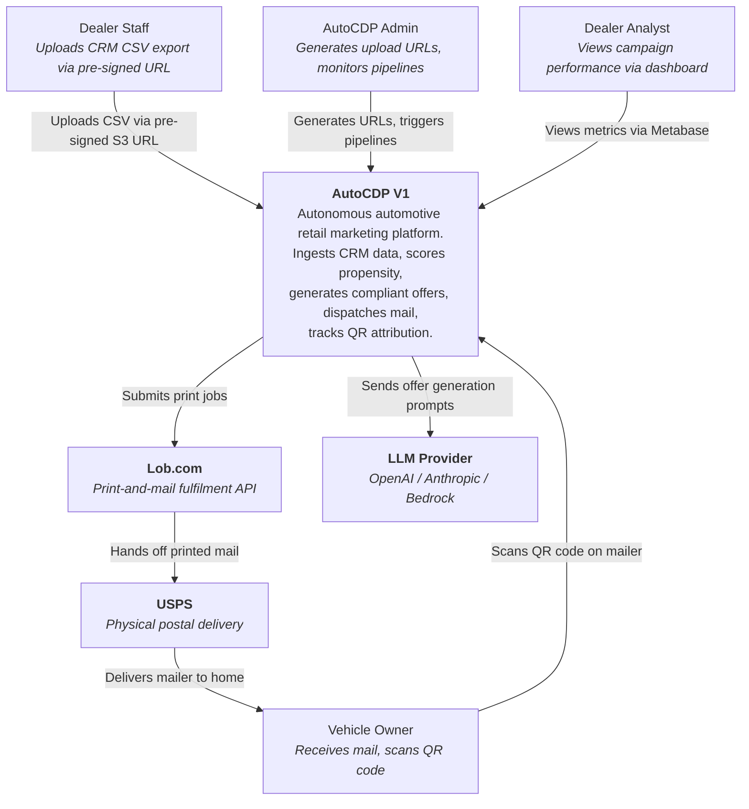
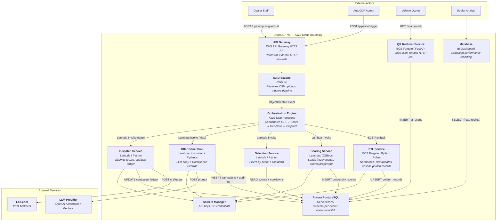
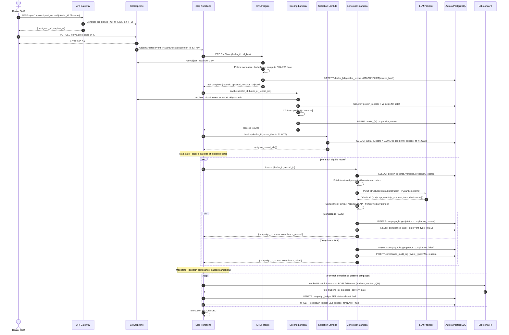
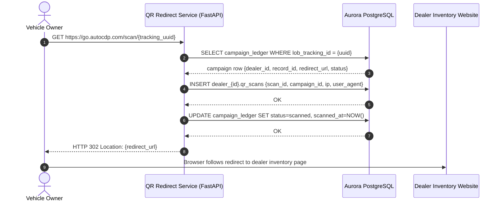
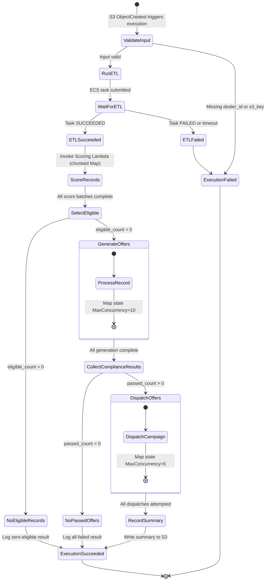

# AutoCDP V1 Architecture

## C4 System Context Diagram

---

## C4 Container Diagram

---

## Sequence Diagram — Full Pipeline (CSV Upload to Mail Dispatch)

---

## Sequence Diagram — QR Scan (Attribution Flow)

---

## Step Functions State Machine

