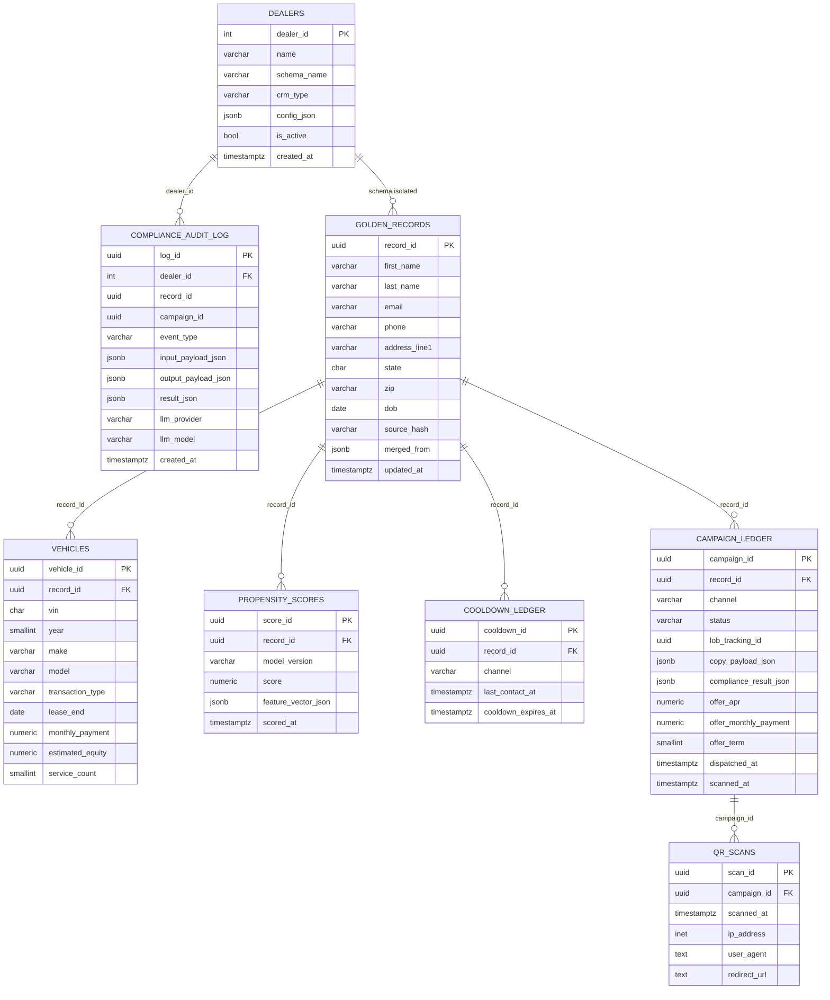

# AutoCDP V1 — Database Design

## Entity-Relationship Diagram

Note: `GOLDEN_RECORDS`, `VEHICLES`, `PROPENSITY_SCORES`, `COOLDOWN_LEDGER`,
`CAMPAIGN_LEDGER`, and `QR_SCANS` all live in the per-dealer schema
(`dealer_{id}.*`). Foreign keys between per-dealer tables are enforced at
the PostgreSQL level. Cross-schema references (e.g., `compliance_audit_log.record_id`
to `golden_records`) are enforced at the application layer to maintain schema isolation.

---

## Primary Access Patterns and Supporting Indexes

### golden_records

| Access Pattern | Query Shape | Supporting Index |
|---|---|---|
| Deduplication on upsert | `WHERE source_hash = $1` | `UNIQUE (source_hash)` |
| Lookup by email | `WHERE email = $1` | `idx_golden_records_email` (partial, NOT NULL) |
| Name search in Metabase | `WHERE last_name ILIKE $1` | `idx_golden_records_last_name` |
| Regional filter | `WHERE state = $1 AND zip = $2` | `idx_golden_records_state_zip` |

### vehicles

| Access Pattern | Query Shape | Supporting Index |
|---|---|---|
| All vehicles for a customer (scoring input) | `WHERE record_id = $1` | `idx_vehicles_record_id` |
| VIN lookup for dedup | `WHERE vin = $1` | `idx_vehicles_vin` (partial, NOT NULL) |
| Lease maturity selection | `WHERE lease_end BETWEEN $1 AND $2` | `idx_vehicles_lease_end` (partial) |
| Transaction type + date for ML feature | `WHERE transaction_type = $1 ORDER BY transaction_date DESC` | `idx_vehicles_transaction_type_date` |

### propensity_scores

| Access Pattern | Query Shape | Supporting Index |
|---|---|---|
| Scores for a specific record | `WHERE record_id = $1` | `idx_propensity_record_id` |
| Selection: top scores above threshold | `WHERE model_version = $1 AND score > $2 ORDER BY score DESC` | `idx_propensity_model_score` |
| Latest scoring run results | `ORDER BY scored_at DESC LIMIT $1` | `idx_propensity_scored_at` |

### cooldown_ledger

| Access Pattern | Query Shape | Supporting Index |
|---|---|---|
| Cooldown check during selection | `WHERE record_id = $1 AND channel = $2` | `UNIQUE (record_id, channel)` |
| Batch cooldown filter | `WHERE channel = $1 AND cooldown_expires_at > NOW()` | `idx_cooldown_expires` |

### campaign_ledger

| Access Pattern | Query Shape | Supporting Index |
|---|---|---|
| QR scan lookup by tracking UUID | `WHERE lob_tracking_id = $1` | `idx_campaign_lob_tracking` (partial) |
| All campaigns for a customer | `WHERE record_id = $1` | `idx_campaign_record_id` |
| Status-based filtering | `WHERE status = $1 ORDER BY created_at DESC` | `idx_campaign_status` + `idx_campaign_created_at` |
| Channel + status funnel metrics | `WHERE channel = $1 AND status = $2` | `idx_campaign_channel_status` |

### qr_scans

| Access Pattern | Query Shape | Supporting Index |
|---|---|---|
| All scans for a campaign | `WHERE campaign_id = $1` | `idx_qr_scans_campaign_id` |
| Recent scan activity | `ORDER BY scanned_at DESC` | `idx_qr_scans_scanned_at` |

---

## Index Justification

**Partial indexes on nullable columns:** PostgreSQL partial indexes (`WHERE column IS NOT NULL`)
are smaller than full indexes on columns with high NULL rates. `vin`, `email`, and
`lob_tracking_id` can be NULL. A partial index covers all rows where the lookup is meaningful.

**NUMERIC over FLOAT for financial columns:** `FLOAT` (IEEE 754) cannot represent common decimals
exactly (0.10 is actually 0.1000000000000000055...). APR and payment calculations under Reg Z
must be exact. `NUMERIC(5,3)` for APR and `NUMERIC(10,2)` for payments guarantees exact decimal
arithmetic, matching the Pydantic `Decimal` type in the compliance engine.

**UUID primary keys (not SERIAL) for operational tables:** UUID v4 keys are generated without a
DB round-trip. In a Lambda-per-record Map state, each Lambda computes its own campaign_id before
inserting, enabling idempotent retries. SERIAL would require a sequence round-trip.

**SERIAL for dealers.dealer_id:** Dealer identifiers appear in URL paths (`/api/v1/campaigns/42`),
schema names (`dealer_42`), and human configuration. Small integers are operationally friendlier.

**JSONB for feature_vector_json and compliance_result_json:** The XGBoost feature vector shape and
compliance result structure evolve across model versions without requiring schema migrations. JSONB
stores these as compressed binary with GIN-indexable fields if needed.

---

## Schema-Per-Dealer Rationale

### Why not shared tables with dealer_id column?

- **Data bleed risk:** A bug in a WHERE clause can return rows belonging to another dealer. With
  schema isolation, the application must explicitly switch schemas.
- **Metabase complexity:** Dashboard queries must always include `dealer_id = $1`. A missing
  predicate exposes all dealers' data. Per-schema isolation makes this physically impossible.
- **Index efficiency:** Per-schema, each dealer's index covers only their 50k rows.

### Why not database-per-dealer?

- **Connection overhead:** Each Aurora cluster costs minimum ~$43/month. At 5 dealers, that wastes
  budget vs. one shared cluster with schema isolation.
- **Operational overhead:** Schema provisioning is one SQL function call. Cluster provisioning
  requires Terraform, DNS, IAM, and Secrets Manager per dealer.
- **V3 cross-dealer analytics:** Training the ML model on cross-dealer data is simpler when all
  dealers share a cluster.

### Schema isolation enforcement

1. Each service receives `dealer_id` as input.
2. Looks up `schema_name` from `public.dealers` (cached).
3. Sets `search_path = dealer_{id}, public` for the connection.
4. All queries use unqualified table names, resolving within the dealer's schema.
5. No query uses string-interpolated schema names from user input.

---

## GLBA Compliance Considerations

| Control | Implementation |
|---|---|
| Encryption at rest | Aurora KMS encryption (AES-256), enabled at cluster creation |
| Encryption in transit | SSL required on all Aurora connections (`sslmode=require`) |
| Access control | IAM roles per Lambda/Fargate task, minimum necessary permissions |
| Audit trail | `compliance_audit_log` is append-only, IAM denies DELETE |
| Data retention | V1 retains indefinitely; automated purge procedure before V2 |
| Data segmentation | Schema-per-dealer physical isolation |
| Minimum data collection | Only dealer-provided CSV data, no external enrichment in V1 |

---

## Storage Estimates (V1 Scale: 1-5 Dealers, 12 months)

Assumptions per dealer: 50k golden records, 1.2 vehicles/record, 3 score runs/month,
7.5k campaigns/month, ~10% QR scan rate.

| Table | Row count (12 mo) | Avg row size | Total per dealer |
|---|---|---|---|
| golden_records | 50,000 | ~400 bytes | ~20 MB |
| vehicles | 60,000 | ~300 bytes | ~18 MB |
| propensity_scores | 1,800,000 | ~200 bytes | ~360 MB |
| cooldown_ledger | 50,000 | ~100 bytes | ~5 MB |
| campaign_ledger | 90,000 | ~2 KB | ~180 MB |
| qr_scans | 9,000 | ~300 bytes | ~3 MB |
| **Per-dealer total** | | | **~586 MB** |
| **5 dealers** | | | **~2.9 GB** |
| public schema | — | — | ~50 MB |
| **Grand total** | | | **~3 GB** |

At 3 GB total, Aurora Serverless v2 at 0.5 ACU minimum is well within capacity.
The dominant cost driver is ACU-hours, not storage. Propensity scores are the largest
growth driver; a V2 retention policy keeping only the 3 most recent score runs would
reduce this to ~30 MB per dealer.
