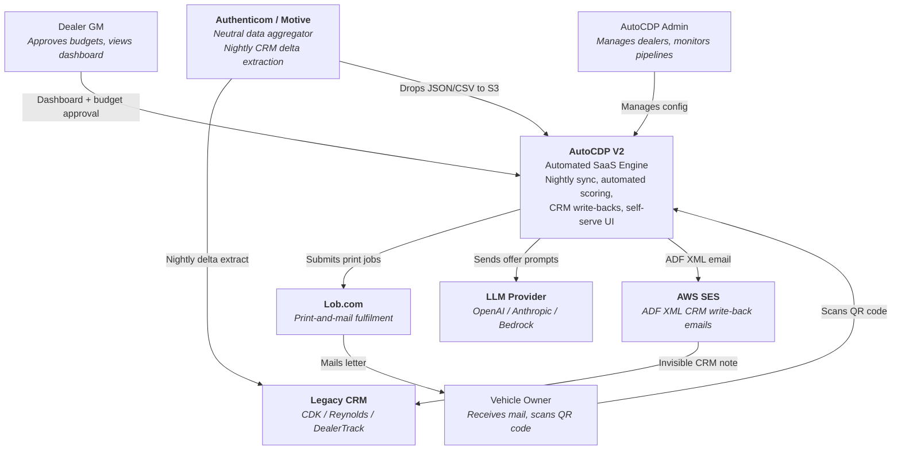
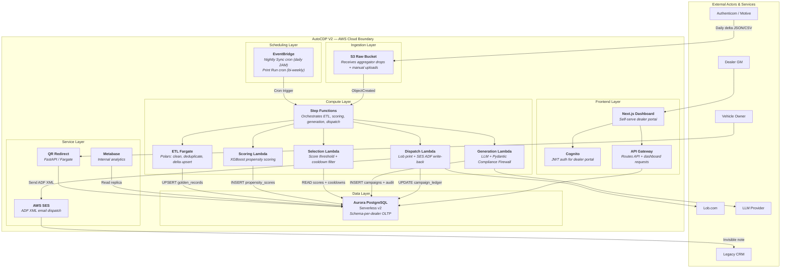
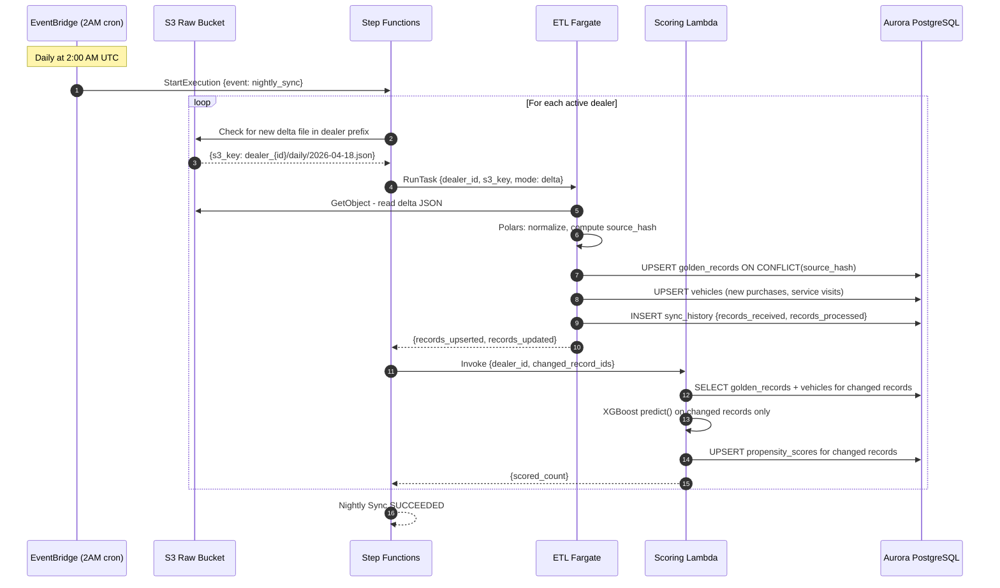
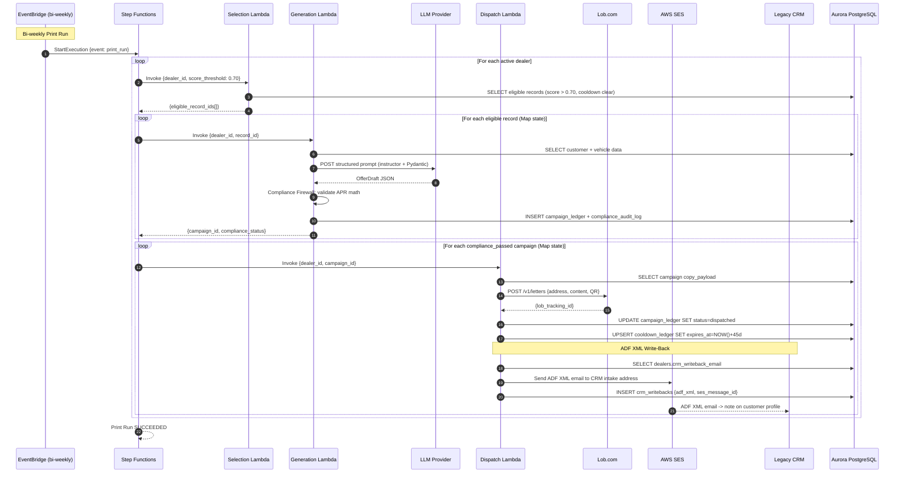
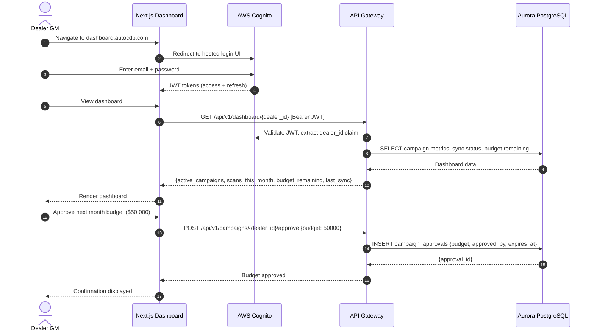
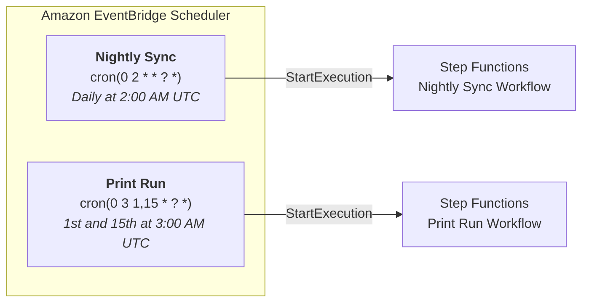

# AutoCDP V2 Architecture

## C4 System Context Diagram

---

## C4 Container Diagram

---

## Sequence Diagram — Nightly Sync Flow

---

## Sequence Diagram — Print Run + ADF XML Write-Back

---

## Sequence Diagram — Dealer Self-Serve Dashboard

---

## EventBridge Scheduling Configuration

