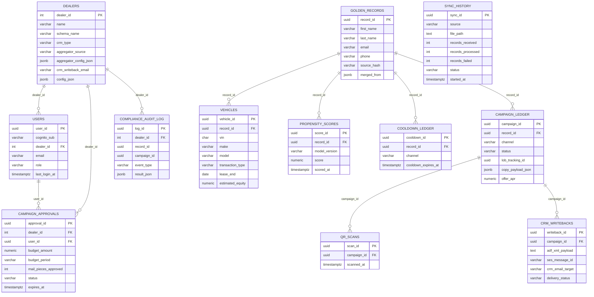

# AutoCDP V2 — Database Design

## Entity-Relationship Diagram (V1 + V2 Tables)



---

## V2 Access Patterns

### sync_history

| Access Pattern | Query Shape | Supporting Index |
|---|---|---|
| Latest sync status for dashboard | `WHERE status = $1 ORDER BY started_at DESC LIMIT 1` | `idx_sync_history_status` + `idx_sync_history_started` |
| Sync history list (paginated) | `ORDER BY started_at DESC LIMIT $1 OFFSET $2` | `idx_sync_history_started` |
| Failed syncs for alerting | `WHERE status = 'failed' AND started_at > NOW() - INTERVAL '24h'` | `idx_sync_history_status` |

### crm_writebacks

| Access Pattern | Query Shape | Supporting Index |
|---|---|---|
| Write-back for a specific campaign | `WHERE campaign_id = $1` | `idx_writebacks_campaign` |
| Recent write-backs for monitoring | `ORDER BY sent_at DESC LIMIT $1` | `idx_writebacks_sent` |
| Bounced write-backs for retry | `WHERE delivery_status = 'bounced'` | Sequential scan (low volume, no dedicated index) |

### users

| Access Pattern | Query Shape | Supporting Index |
|---|---|---|
| Auth lookup by Cognito sub | `WHERE cognito_sub = $1` | `UNIQUE (cognito_sub)` |
| Users for a dealer | `WHERE dealer_id = $1` | `idx_users_dealer_id` |

### campaign_approvals

| Access Pattern | Query Shape | Supporting Index |
|---|---|---|
| Active budget for a dealer | `WHERE dealer_id = $1 AND status = 'active' AND expires_at > NOW()` | `idx_approvals_status` |
| Budget check before print run | Same as above | Same |

---

## Delta Processing Design (V2 Upsert Strategy)

V2 replaces V1's full-load ingestion with incremental delta processing:

1. **Authenticom drops a daily delta file** containing only records that changed since the previous extraction (new customers, updated vehicles, new service records).

2. **ETL reads the delta** and computes `source_hash = SHA-256(lower(first_name + last_name + zip + dob))` for each row.

3. **UPSERT logic:**
   ```sql
   INSERT INTO dealer_{id}.golden_records (...)
   VALUES (...)
   ON CONFLICT (source_hash) DO UPDATE SET
       email = EXCLUDED.email,
       phone = EXCLUDED.phone,
       address_line1 = EXCLUDED.address_line1,
       -- ... other mutable fields
       updated_at = NOW()
   WHERE golden_records.updated_at < EXCLUDED.updated_at;
   ```
   The `WHERE` clause prevents stale deltas from overwriting newer data.

4. **Vehicles are upserted** similarly, keyed on `(record_id, vin, transaction_type)`.

5. **Only changed records are re-scored.** The ETL returns a list of `record_ids` that were inserted or updated. The Scoring Lambda receives this list and re-scores only those records, avoiding full-table rescoring.

### Why delta instead of full reload?

| Factor | Full Reload | Delta Processing |
|---|---|---|
| Data volume per run | 50k+ rows (full export) | ~500 rows (daily changes) |
| ETL duration | 10-20 minutes | 1-3 minutes |
| Aurora write load | ~50 TPS burst | ~5 TPS burst |
| Scoring load | All 50k records | ~500 records |
| Fargate cost per run | ~$0.05 | ~$0.005 |

---

## ADF XML Write-Back Tracking

The `crm_writebacks` table provides a complete audit trail:

1. **On dispatch**, the Dispatch Lambda generates ADF XML:
   ```xml
   <?xml version="1.0"?>
   <?ADF VERSION="1.0"?>
   <adf>
     <prospect>
       <customer>
         <contact>
           <name part="first">Sarah</name>
           <name part="last">Johnson</name>
         </contact>
       </customer>
       <vendor>
         <contact>
           <name>AutoCDP System</name>
         </contact>
       </vendor>
       <provider>
         <contact>
           <name>AutoCDP</name>
         </contact>
       </provider>
     </prospect>
   </adf>
   ```

2. **SES sends the email** to `crm_writeback_email` (e.g., `leads-dealer104@cdkglobal.com`).

3. **SES returns `message_id`**, stored in `crm_writebacks.ses_message_id`.

4. **SES delivery notifications** (via SNS) update `delivery_status` to `delivered` or `bounced`.

5. **Bounced write-backs** are flagged for investigation. Common cause: incorrect CRM email address in `dealers.crm_writeback_email`.

---

## Cooldown Enforcement Query (V2)

The bi-weekly print run uses this query to find eligible customers:

```sql
SELECT ps.record_id, ps.score
  FROM dealer_{id}.propensity_scores ps
  LEFT JOIN dealer_{id}.cooldown_ledger cl
    ON cl.record_id = ps.record_id AND cl.channel = 'mail'
 WHERE ps.model_version = (SELECT model_version FROM dealer_{id}.propensity_scores ORDER BY scored_at DESC LIMIT 1)
   AND ps.score > 0.70
   AND (cl.cooldown_expires_at IS NULL OR cl.cooldown_expires_at < NOW())
 ORDER BY ps.score DESC;
```

The `LEFT JOIN` ensures customers with no cooldown entry (never contacted) are included.

---

## Migration Plan: V1 to V2

1. **ALTER public.dealers** — Add `aggregator_source`, `aggregator_config_json`, `crm_writeback_email` columns.
2. **CREATE public.users** and **public.campaign_approvals** tables.
3. **For each existing dealer schema**, run `provision_dealer_schema_v2()` to add `sync_history` and `crm_writebacks` tables.
4. **Backfill dealers.crm_writeback_email** with CRM intake addresses obtained during onboarding.
5. **Create Cognito user pool** and invite dealer GMs.
6. **Deploy EventBridge rules** for nightly sync and bi-weekly print run.
7. **Configure Authenticom extraction** for each dealer.

Migration is non-destructive. All V1 data is preserved. New tables are additive.

---

## Storage Estimates (V2: 50 Dealers, 12 months)

| Table | Rows per dealer (12 mo) | Size per dealer | 50 dealers |
|---|---|---|---|
| golden_records | 50,000 | ~20 MB | 1 GB |
| vehicles | 60,000 | ~18 MB | 900 MB |
| propensity_scores | 1,800,000 | ~360 MB | 18 GB |
| cooldown_ledger | 50,000 | ~5 MB | 250 MB |
| campaign_ledger | 120,000 | ~240 MB | 12 GB |
| qr_scans | 12,000 | ~4 MB | 200 MB |
| sync_history | 365 | ~1 MB | 50 MB |
| crm_writebacks | 120,000 | ~120 MB | 6 GB |
| **Per-dealer total** | | **~768 MB** | |
| **50 dealers** | | | **~38.4 GB** |
| public schema | | | ~200 MB |
| **Grand total** | | | **~39 GB** |

At 39 GB, Aurora Serverless v2 handles this comfortably. Propensity scores
remain the largest growth driver. V2 should implement a retention policy:
keep only the 3 most recent score runs per record, reducing propensity
storage to ~30 MB/dealer (~1.5 GB for 50 dealers).

With retention: **~22 GB total** for 50 dealers.
