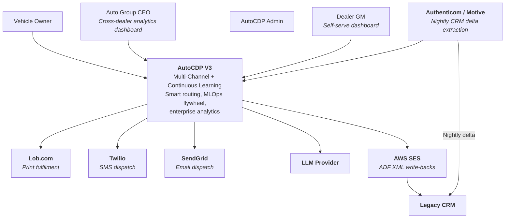
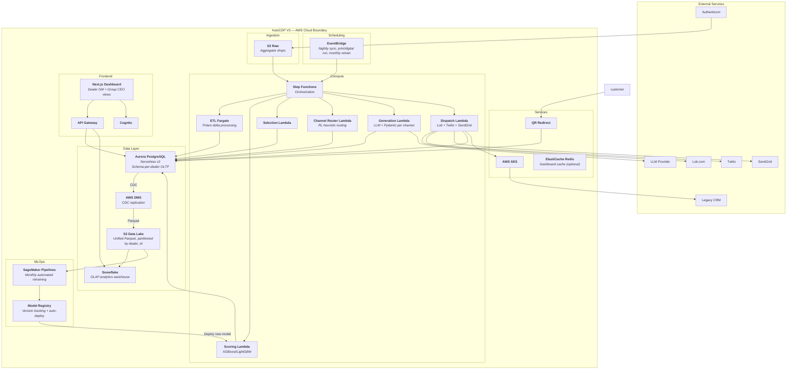
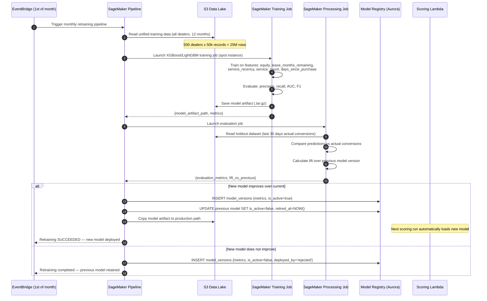
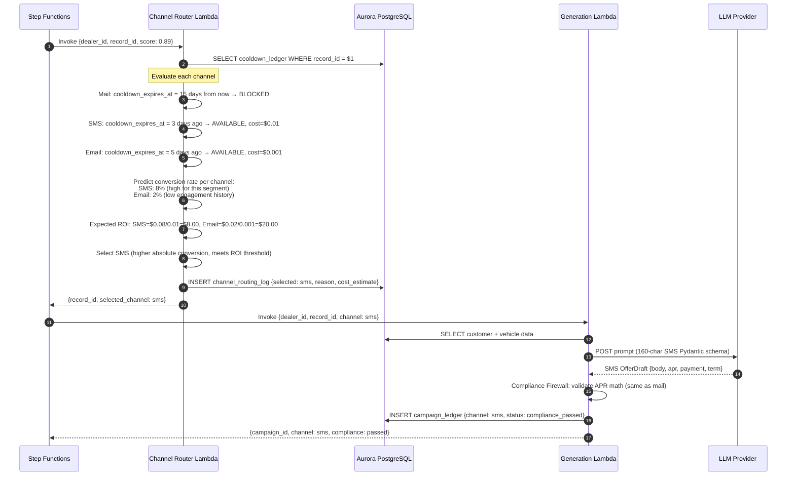
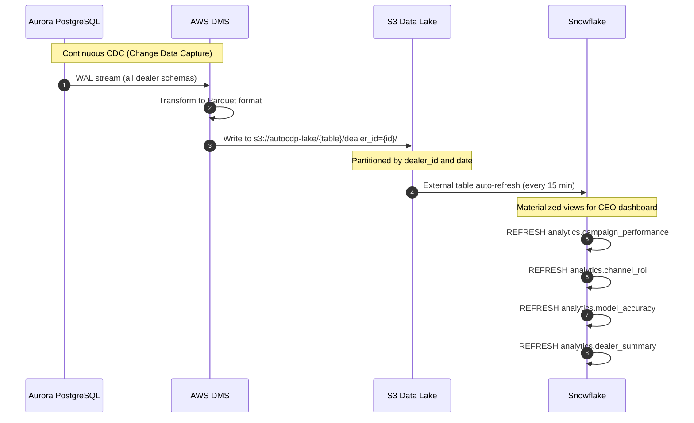
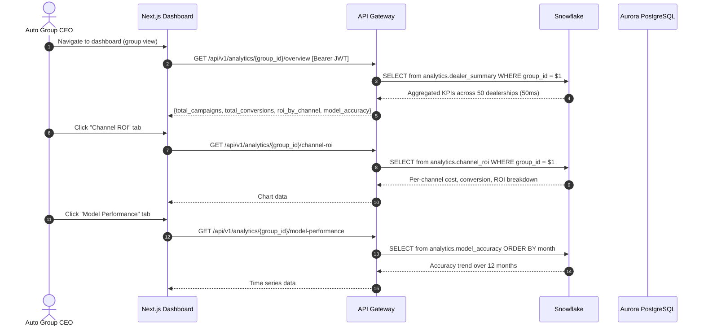
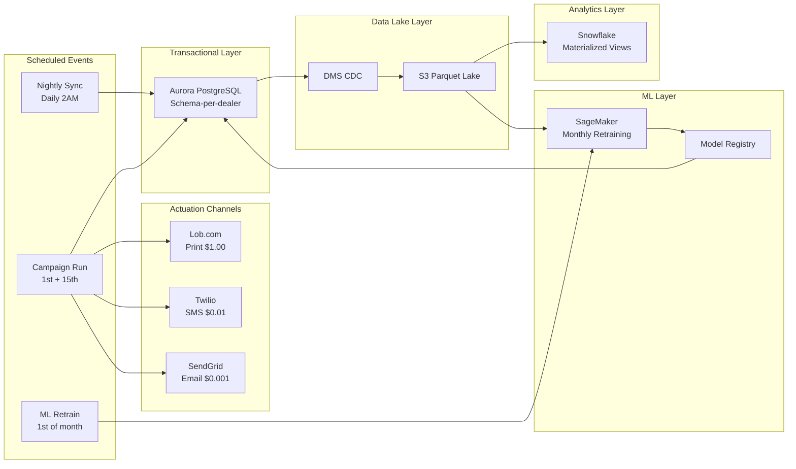

# AutoCDP V3 Architecture

## C4 System Context Diagram

---

## C4 Container Diagram

---

## Sequence Diagram — Monthly ML Retraining Pipeline

---

## Sequence Diagram — Smart Channel Router Decision

---

## Sequence Diagram — Data Lake CDC Pipeline

---

## Sequence Diagram — CEO Analytics Dashboard

---

## Full V3 Service Topology

