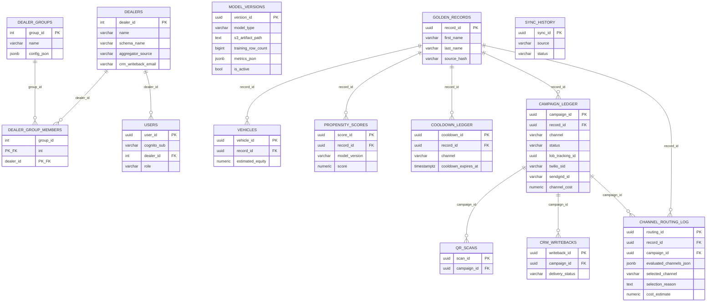
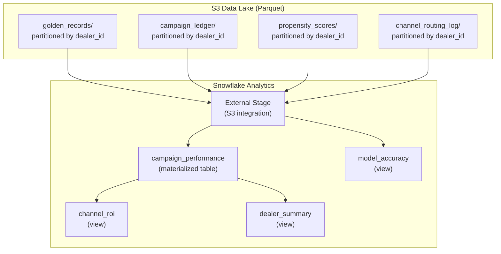

# AutoCDP V3 — Database Design

## Entity-Relationship Diagram (Full V1 + V2 + V3)



---

## Snowflake Schema Diagram



---

## Data Lake Partitioning Strategy

The S3 data lake stores Parquet files with the following structure:

```
s3://autocdp-data-lake/
  golden_records/
    dealer_id=104/
      2026-04-18/part-00001.parquet
    dealer_id=207/
      2026-04-18/part-00001.parquet
  campaign_ledger/
    dealer_id=104/
      2026-04-18/part-00001.parquet
  propensity_scores/
    dealer_id=104/
      2026-04-18/part-00001.parquet
  channel_routing_log/
    dealer_id=104/
      2026-04-18/part-00001.parquet
  vehicles/
    dealer_id=104/
      2026-04-18/part-00001.parquet
```

**Partitioning by `dealer_id`** enables:
- Snowflake partition pruning on dealer-specific queries
- SageMaker training can select specific dealers or all dealers
- S3 lifecycle policies can archive old partitions per dealer

**Daily date subdirectories** enable:
- Incremental processing by SageMaker (only read last 30 days for retraining)
- Snowflake auto-refresh knows which files are new

---

## CDC Replication Design (Aurora -> S3 -> Snowflake)

### AWS DMS Configuration

| Parameter | Value |
|---|---|
| Source | Aurora PostgreSQL (all dealer schemas) |
| Target | S3 bucket (`autocdp-data-lake`) |
| Migration type | CDC only (full load done once at V3 launch) |
| Output format | Parquet |
| Partitioning | `dealer_id` extracted from schema name |
| CDC frequency | Continuous (near real-time, ~15 second lag) |
| Replication instance | dms.t3.medium (~$50/month) |

### How schema-per-dealer maps to unified lake

DMS captures WAL changes from ALL dealer schemas. A custom transformation rule
maps the schema name (`dealer_104`) to a `dealer_id` column in the Parquet output:

```json
{
  "rule-type": "transformation",
  "rule-action": "add-column",
  "rule-target": "column",
  "value": "dealer_id",
  "expression": "REPLACE(schema_name, 'dealer_', '')"
}
```

This is the key architectural bridge: **schema-per-dealer in OLTP becomes a single
partitioned table in the data lake.** The ML model trains on the unified view.

---

## Channel Routing Query Patterns

### Cooldown check (per channel)

```sql
SELECT
    record_id,
    channel,
    cooldown_expires_at,
    CASE WHEN cooldown_expires_at > NOW() THEN TRUE ELSE FALSE END AS is_blocked
FROM dealer_{id}.cooldown_ledger
WHERE record_id = $1;
```

Returns one row per channel for which a cooldown exists. Channels with no row = no cooldown = available.

### Eligible records with channel availability

```sql
SELECT
    ps.record_id,
    ps.score,
    COALESCE(cl_mail.cooldown_expires_at < NOW(), TRUE) AS mail_available,
    COALESCE(cl_sms.cooldown_expires_at < NOW(), TRUE) AS sms_available,
    COALESCE(cl_email.cooldown_expires_at < NOW(), TRUE) AS email_available
FROM dealer_{id}.propensity_scores ps
LEFT JOIN dealer_{id}.cooldown_ledger cl_mail
    ON cl_mail.record_id = ps.record_id AND cl_mail.channel = 'mail'
LEFT JOIN dealer_{id}.cooldown_ledger cl_sms
    ON cl_sms.record_id = ps.record_id AND cl_sms.channel = 'sms'
LEFT JOIN dealer_{id}.cooldown_ledger cl_email
    ON cl_email.record_id = ps.record_id AND cl_email.channel = 'email'
WHERE ps.score > 0.70
    AND (cl_mail.cooldown_expires_at IS NULL OR cl_mail.cooldown_expires_at < NOW()
     OR cl_sms.cooldown_expires_at IS NULL OR cl_sms.cooldown_expires_at < NOW()
     OR cl_email.cooldown_expires_at IS NULL OR cl_email.cooldown_expires_at < NOW())
ORDER BY ps.score DESC;
```

Returns records where AT LEAST ONE channel is available.

---

## Model Registry Access Patterns

| Access Pattern | Query Shape |
|---|---|
| Current active model | `SELECT * FROM model_versions WHERE is_active = TRUE` |
| Model history | `SELECT * FROM model_versions ORDER BY created_at DESC` |
| Model by version | `SELECT * FROM model_versions WHERE version_id = $1` |
| Retire a model | `UPDATE model_versions SET is_active = FALSE, retired_at = NOW() WHERE version_id = $1` |

---

## Migration Plan: V2 to V3

1. **Create public.model_versions** and **public.dealer_groups** tables.
2. **For each existing dealer schema**, run `provision_dealer_schema_v3()`:
   - Adds `twilio_sid`, `sendgrid_id`, `channel_cost` columns to `campaign_ledger`
   - Creates `channel_routing_log` table
3. **Deploy DMS replication task**: Full load of all existing data to S3, then switch to CDC.
4. **Set up Snowflake**: Create database, schemas, external stage, tables, and views.
5. **Seed model_versions**: Insert V2's frozen XGBoost model as the initial active version.
6. **Deploy SageMaker Pipeline**: Test monthly retrain on historical data.
7. **Configure Twilio and SendGrid**: API keys, phone numbers, sender domains.
8. **Add EventBridge rule**: Monthly retrain cron on 1st of each month.
9. **Update frontend**: Add group CEO dashboard views, channel ROI charts.

Migration is non-destructive. All V1/V2 data and functionality preserved.

---

## Storage Estimates (V3: 500 Dealers, 12 months)

### Aurora OLTP

| Table | Per dealer (12 mo) | 500 dealers |
|---|---|---|
| golden_records | ~20 MB | 10 GB |
| vehicles | ~18 MB | 9 GB |
| propensity_scores (3 retained) | ~30 MB | 15 GB |
| cooldown_ledger | ~5 MB | 2.5 GB |
| campaign_ledger | ~300 MB | 150 GB |
| qr_scans | ~5 MB | 2.5 GB |
| sync_history | ~1 MB | 500 MB |
| crm_writebacks | ~150 MB | 75 GB |
| channel_routing_log | ~200 MB | 100 GB |
| **Per-dealer total** | **~729 MB** | |
| **500 dealers** | | **~365 GB** |

### S3 Data Lake
- Parquet compression ~4x vs raw
- ~365 GB / 4 = ~90 GB compressed Parquet
- S3 cost: ~$2/month for 90 GB

### Snowflake
- Materialized tables: ~50 GB (aggregated)
- Snowflake XS warehouse: auto-suspend after 1 minute
- Monthly cost: ~$500-3,000 depending on query volume

### SageMaker Training
- Monthly training on 25M rows: ~2 hours on ml.m5.xlarge spot ($0.15/hr)
- Monthly cost: ~$0.30 per training run + S3 I/O
- With evaluation: ~$1-5/month

---

## Read/Write TPS by Table (V3: 500 Dealers)

| Table | Read TPS (avg/burst) | Write TPS (avg/burst) | Notes |
|---|---|---|---|
| golden_records | 5/100 | 10/500 | Nightly sync burst |
| vehicles | 5/100 | 10/500 | Nightly sync burst |
| propensity_scores | 10/200 | 10/500 | Scoring after sync |
| cooldown_ledger | 20/200 | 5/100 | Campaign run checks |
| campaign_ledger | 20/200 | 10/200 | Campaign execution |
| channel_routing_log | 2/50 | 10/200 | Campaign routing |
| qr_scans | 5/50 | 5/100 | Daytime scan traffic |
| sync_history | 1/10 | 1/5 | Dashboard queries |
| crm_writebacks | 1/10 | 5/100 | Post-dispatch |
| compliance_audit_log | 1/20 | 10/200 | During generation |
| **Aurora total** | **~70/940** | **~76/2400** | 4-16 ACU range |
