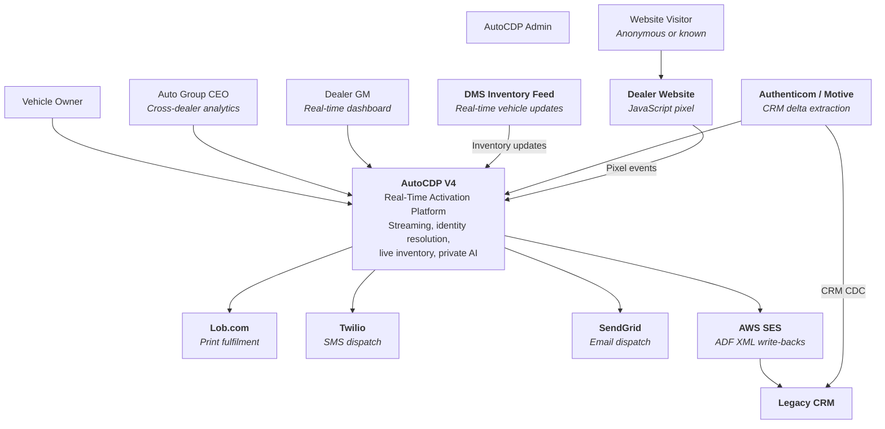
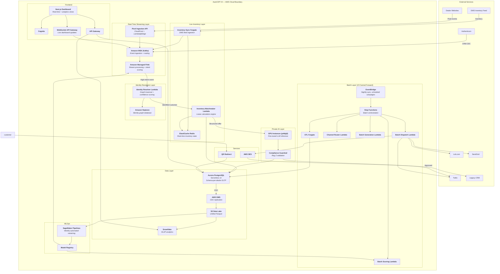
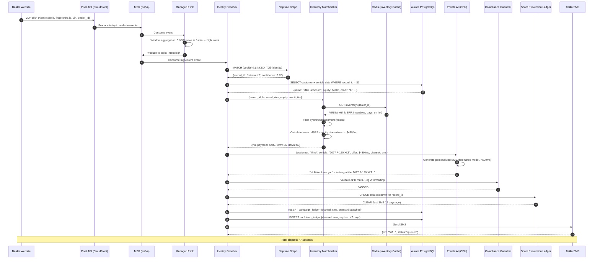
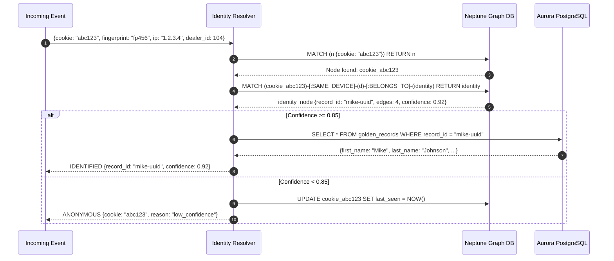
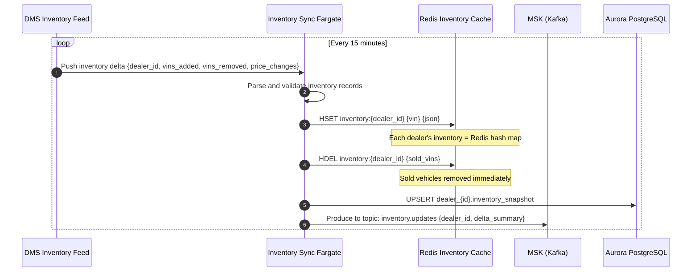
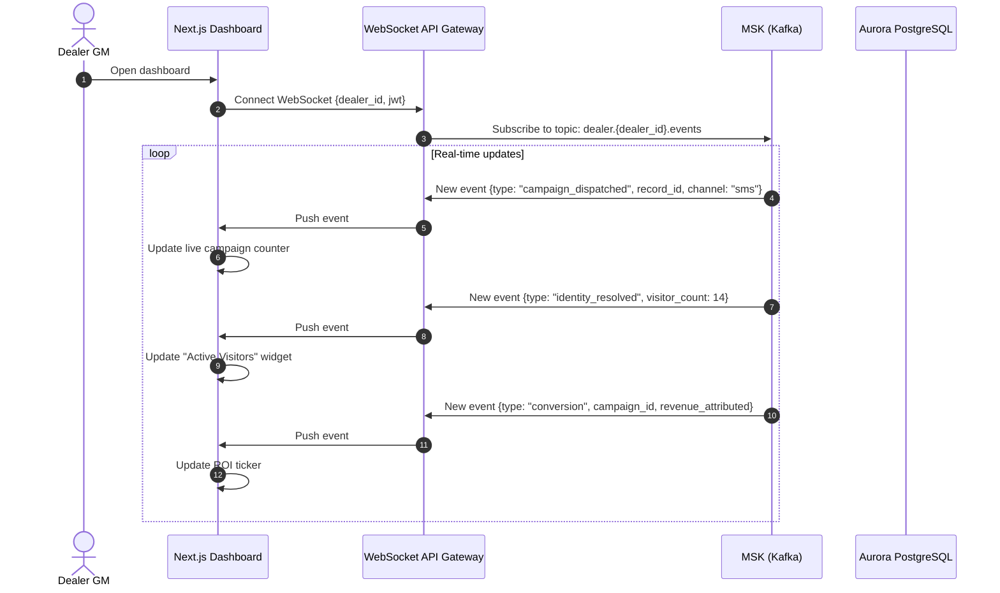
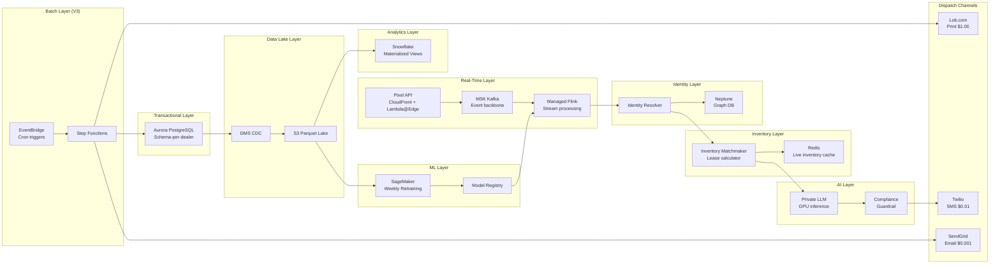

# AutoCDP V4 Architecture

## C4 System Context Diagram

---

## C4 Container Diagram

---

## Sequence Diagram — Real-Time Intent-to-Offer Pipeline

---

## Sequence Diagram — Identity Graph Resolution

---

## Sequence Diagram — Inventory Sync Pipeline

---

## Sequence Diagram — Real-Time Dashboard via WebSocket

---

## Full V4 Service Topology

