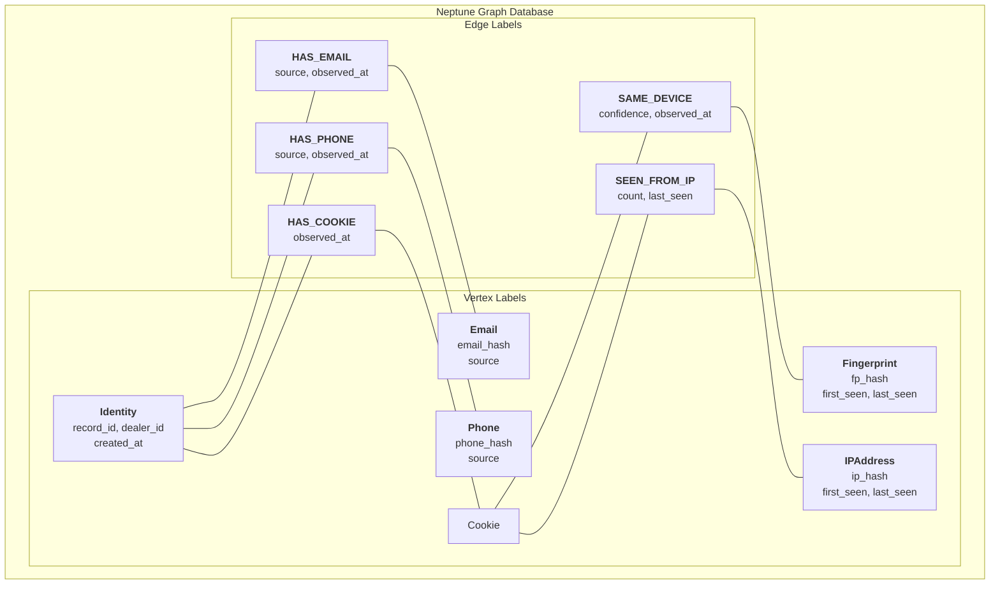
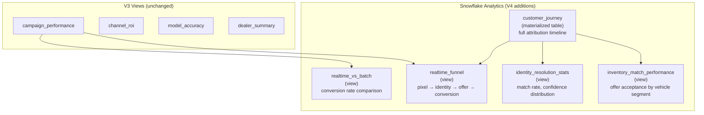

# AutoCDP V4 — Database Design

## Entity-Relationship Diagram (Full V1 + V2 + V3 + V4)

```mermaid
erDiagram
    DEALER_GROUPS {
        int group_id PK
        varchar name
        jsonb config_json
    }

    DEALER_GROUP_MEMBERS {
        int group_id PK_FK
        int dealer_id PK_FK
    }

    DEALERS {
        int dealer_id PK
        varchar name
        varchar schema_name
        varchar aggregator_source
        varchar crm_writeback_email
        varchar pixel_site_id
        varchar dms_feed_id
    }

    USERS {
        uuid user_id PK
        varchar cognito_sub
        int dealer_id FK
        varchar role
    }

    MODEL_VERSIONS {
        uuid version_id PK
        varchar model_type
        text s3_artifact_path
        bigint training_row_count
        jsonb metrics_json
        bool is_active
    }

    GOLDEN_RECORDS {
        uuid record_id PK
        varchar first_name
        varchar last_name
        varchar source_hash
    }

    IDENTITY_GRAPH_LINKS {
        uuid link_id PK
        uuid record_id FK
        varchar identifier_type
        varchar identifier_value
        numeric confidence
    }

    VEHICLES {
        uuid vehicle_id PK
        uuid record_id FK
        numeric estimated_equity
    }

    INVENTORY_SNAPSHOT {
        varchar vin PK
        varchar make
        varchar model
        varchar trim
        numeric msrp
        numeric invoice
        int days_on_lot
        varchar status
        jsonb incentives_json
    }

    PROPENSITY_SCORES {
        uuid score_id PK
        uuid record_id FK
        varchar model_version
        numeric score
    }

    INTENT_EVENTS {
        uuid event_id PK
        uuid record_id FK
        varchar event_type
        jsonb event_data
        numeric intent_score
        timestamptz event_at
    }

    COOLDOWN_LEDGER {
        uuid cooldown_id PK
        uuid record_id FK
        varchar channel
        timestamptz cooldown_expires_at
    }

    CAMPAIGN_LEDGER {
        uuid campaign_id PK
        uuid record_id FK
        varchar channel
        varchar status
        varchar trigger_type
        uuid matched_vin FK
        uuid lob_tracking_id
        varchar twilio_sid
        varchar sendgrid_id
        numeric channel_cost
    }

    CHANNEL_ROUTING_LOG {
        uuid routing_id PK
        uuid record_id FK
        uuid campaign_id FK
        jsonb evaluated_channels_json
        varchar selected_channel
        text selection_reason
        numeric cost_estimate
    }

    INVENTORY_MATCH_LOG {
        uuid match_id PK
        uuid campaign_id FK
        uuid record_id FK
        varchar matched_vin
        jsonb candidates_json
        numeric offered_payment
        int offered_term
        numeric match_score
    }

    QR_SCANS {
        uuid scan_id PK
        uuid campaign_id FK
    }

    ATTRIBUTION_EVENTS {
        uuid attribution_id PK
        uuid campaign_id FK
        uuid record_id FK
        varchar event_type
        jsonb event_data
        timestamptz event_at
    }

    SYNC_HISTORY {
        uuid sync_id PK
        varchar source
        varchar status
    }

    CRM_WRITEBACKS {
        uuid writeback_id PK
        uuid campaign_id FK
        varchar delivery_status
    }

    DEALER_GROUPS ||--o{ DEALER_GROUP_MEMBERS : "group_id"
    DEALERS ||--o{ DEALER_GROUP_MEMBERS : "dealer_id"
    DEALERS ||--o{ USERS : "dealer_id"
    GOLDEN_RECORDS ||--o{ IDENTITY_GRAPH_LINKS : "record_id"
    GOLDEN_RECORDS ||--o{ VEHICLES : "record_id"
    GOLDEN_RECORDS ||--o{ PROPENSITY_SCORES : "record_id"
    GOLDEN_RECORDS ||--o{ INTENT_EVENTS : "record_id"
    GOLDEN_RECORDS ||--o{ COOLDOWN_LEDGER : "record_id"
    GOLDEN_RECORDS ||--o{ CAMPAIGN_LEDGER : "record_id"
    GOLDEN_RECORDS ||--o{ CHANNEL_ROUTING_LOG : "record_id"
    GOLDEN_RECORDS ||--o{ ATTRIBUTION_EVENTS : "record_id"
    CAMPAIGN_LEDGER ||--o{ QR_SCANS : "campaign_id"
    CAMPAIGN_LEDGER ||--o{ CRM_WRITEBACKS : "campaign_id"
    CAMPAIGN_LEDGER ||--o{ CHANNEL_ROUTING_LOG : "campaign_id"
    CAMPAIGN_LEDGER ||--o{ INVENTORY_MATCH_LOG : "campaign_id"
    CAMPAIGN_LEDGER ||--o{ ATTRIBUTION_EVENTS : "campaign_id"
    INVENTORY_SNAPSHOT ||--o{ INVENTORY_MATCH_LOG : "matched_vin"
```



---

## Neptune Identity Graph Schema



### Graph Traversal for Identity Resolution

```
g.V().has('Cookie', 'cookie_value', 'abc123')
  .out('SAME_DEVICE')
  .out('BELONGS_TO')
  .has('Identity', 'dealer_id', 104)
  .project('record_id', 'confidence', 'path_length')
  .by('record_id')
  .by(select('confidence'))
  .by(path().count(local))
```

Confidence scoring:
- Direct cookie → identity link: 0.95
- Cookie → fingerprint → identity (2 hops): 0.85
- Cookie → IP → identity (2 hops): 0.60 (below threshold, no match)
- Multiple corroborating paths increase confidence

---

## Redis Inventory Cache Schema

```
Key pattern: inventory:{dealer_id}
Type: Hash map
Field: VIN
Value: JSON

Example:
  HSET inventory:104 "1FTFW1E87NFA12345" '{
    "vin": "1FTFW1E87NFA12345",
    "make": "Ford",
    "model": "F-150",
    "trim": "XLT",
    "year": 2027,
    "msrp": 52495,
    "invoice": 49870,
    "days_on_lot": 23,
    "status": "available",
    "incentives": [
      {"type": "manufacturer_rebate", "amount": 2000, "expires": "2026-05-31"},
      {"type": "loyalty_bonus", "amount": 500, "requires": "ford_trade_in"}
    ],
    "money_factors": {
      "A+": 0.00125,
      "A": 0.00175,
      "B": 0.00250,
      "C": 0.00350
    },
    "residual_36mo": 0.58,
    "residual_24mo": 0.65,
    "updated_at": "2026-04-19T14:30:00Z"
  }'

TTL: No expiry (managed by sync process)
Eviction: Sold vehicles deleted immediately via HDEL
Refresh: Every 15 minutes from DMS feed

Auxiliary keys:
  inventory:{dealer_id}:meta → {total_units, last_sync, avg_days_on_lot}
  inventory:{dealer_id}:segments → {trucks: [vins], sedans: [vins], suvs: [vins]}
```

---

## Kafka Topic Schema

| Topic | Partitions | Key | Retention | Consumers |
|---|---|---|---|---|
| `website.events` | 50 | `dealer_id` | 7 days | Flink intent processor |
| `intent.high` | 20 | `dealer_id` | 3 days | Identity Resolver |
| `intent.low` | 20 | `dealer_id` | 1 day | Data lake archiver |
| `inventory.updates` | 20 | `dealer_id` | 3 days | Flink, dashboard |
| `crm.changes` | 20 | `dealer_id` | 7 days | ETL, identity graph |
| `campaigns.dispatched` | 20 | `dealer_id` | 30 days | Attribution, dashboard |
| `campaigns.delivered` | 20 | `dealer_id` | 30 days | Attribution |
| `identity.resolved` | 20 | `dealer_id` | 7 days | Metrics, dashboard |
| `dealer.{id}.events` | 1 | event_type | 1 day | WebSocket gateway (per-dealer) |

### Event Schema (Avro)

```json
{
  "type": "record",
  "name": "WebsiteEvent",
  "fields": [
    {"name": "event_id", "type": "string"},
    {"name": "dealer_id", "type": "int"},
    {"name": "cookie_id", "type": "string"},
    {"name": "fingerprint", "type": ["null", "string"]},
    {"name": "ip_hash", "type": "string"},
    {"name": "event_type", "type": {"type": "enum", "symbols": ["page_view", "vdp_view", "payment_calc", "trade_in_submit", "chat_start"]}},
    {"name": "page_url", "type": "string"},
    {"name": "vin", "type": ["null", "string"]},
    {"name": "referrer", "type": ["null", "string"]},
    {"name": "user_agent", "type": "string"},
    {"name": "timestamp_ms", "type": "long"}
  ]
}
```

---

## Data Lake Extensions (V4)

```
s3://autocdp-data-lake/
  ... (V3 tables unchanged) ...
  intent_events/
    dealer_id=104/
      2026-04-19/part-00001.parquet
  identity_resolutions/
    dealer_id=104/
      2026-04-19/part-00001.parquet
  inventory_matches/
    dealer_id=104/
      2026-04-19/part-00001.parquet
  attribution_events/
    dealer_id=104/
      2026-04-19/part-00001.parquet
```

---

## Snowflake V4 Views



---

## Storage Estimates (V4: 5,000 Dealers, 12 months)

### Aurora OLTP

| Table | Per dealer (12 mo) | 5,000 dealers |
|---|---|---|
| golden_records | ~20 MB | 100 GB |
| vehicles | ~18 MB | 90 GB |
| propensity_scores | ~30 MB | 150 GB |
| cooldown_ledger | ~5 MB | 25 GB |
| campaign_ledger | ~500 MB | 2.5 TB |
| channel_routing_log | ~300 MB | 1.5 TB |
| intent_events (hot, 30 days) | ~200 MB | 1 TB |
| inventory_snapshot | ~10 MB | 50 GB |
| inventory_match_log | ~100 MB | 500 GB |
| attribution_events | ~50 MB | 250 GB |
| qr_scans | ~5 MB | 25 GB |
| crm_writebacks | ~200 MB | 1 TB |
| **Per-dealer total** | **~1.4 GB** | |
| **5,000 dealers** | | **~7.2 TB** |

### Neptune Graph Database

| Metric | Estimate |
|---|---|
| Identity nodes | ~50M (10k customers x 5k dealers) |
| Cookie/fingerprint nodes | ~200M |
| Edges | ~500M |
| Storage | ~200 GB |
| Instance | db.r6g.xlarge (32 GB RAM) |

### Redis Inventory Cache

| Metric | Estimate |
|---|---|
| Dealers | 5,000 |
| Avg vehicles per dealer | 200 |
| Total entries | 1M |
| Avg entry size | 500 bytes |
| Total memory | ~500 MB |
| Instance | cache.r6g.large (13 GB, headroom for keys) |

### Kafka (MSK)

| Metric | Estimate |
|---|---|
| Events/second (peak) | 50,000 |
| Events/day | ~500M |
| Avg event size | 500 bytes |
| Daily ingestion | ~250 GB |
| Retention (7 days avg) | ~1.75 TB |
| Brokers | 3x kafka.m5.2xlarge |

---

## Read/Write TPS by Table (V4: 5,000 Dealers)

| Table | Read TPS (avg/burst) | Write TPS (avg/burst) | Notes |
|---|---|---|---|
| golden_records | 50/500 | 50/1000 | Real-time + batch sync |
| vehicles | 50/500 | 50/1000 | Real-time + batch sync |
| propensity_scores | 100/1000 | 50/500 | Flink + batch scoring |
| cooldown_ledger | 200/2000 | 100/1000 | Real-time campaign checks |
| campaign_ledger | 200/2000 | 100/1000 | Real-time + batch dispatch |
| intent_events | 50/200 | 500/5000 | High write from Flink |
| inventory_snapshot | 100/500 | 20/100 | Every 15 min sync |
| inventory_match_log | 10/100 | 100/1000 | Real-time matching |
| attribution_events | 10/100 | 50/500 | CDC + webhook callbacks |
| channel_routing_log | 10/100 | 100/1000 | Real-time + batch |
| **Aurora total** | **~780/7000** | **~1120/12000** | 32-64 ACU range |
